English | [中文](zh/git-workflow-tutorial.md)

Note:
======
While learning about `Git` workflows, I found it difficult to fully grasp Git's collaboration model coming from SVN — until I came across the articles referenced below. Many of my long-standing questions suddenly became clear:

- What's wrong with using `Git` the same way we used SVN?
- Where does Git's powerful branching actually shine? How do teams collaborate? What do you do when conflicts arise? How do you manage releases?
- How does the classic master/develop/hotfix model prevent unverified code from reaching production?
- How do you collaborate with others on `GitHub`? What does the star → fork → pull request workflow actually look like?

I'm genuinely grateful for these articles, so I compiled and organized them here in the hope of helping more people. This entire document was compiled by [xirong](https://github.com/xirong) from [oldratlee](https://github.com/oldratlee)'s `GitHub` repositories, bringing everything together for convenient study and reference. Many thanks to both contributors.

Original article: [Git Workflows and Tutorials](https://www.atlassian.com/git/workflows)  
Simplified Chinese translation: by [oldratlee](https://github.com/oldratlee) on `GitHub` — [`Git` Workflow Guide](https://github.com/oldratlee/translations/blob/master/git-workflows-and-tutorials/README.md)

In Part Three, <a href="#three-enterprise-development-patterns">Enterprise Development Patterns</a>, xirong draws on his own company's experience with Git-based version branching and summarizes the lessons learned. Feedback and suggestions are welcome.

In Part Four, <a href="#discussion-on-development-workflows">Discussion on Development Workflows</a>, several articles are referenced — including GitHub's own development process and a Thoughtworks engineer's essay "Gitflow Considered Harmful" — to illustrate that no single workflow is universally correct. The best workflow is the one that fits your team right now.

--------------

<p data-anchor-id="bd8d"><div class="toc">
<ul>
<li><a href="#one-translators-preface">One: Translator's Preface</a></li>
<li><a href="#two-git-workflow-guide">Two: Git Workflow Guide</a><ul>
<li><a href="#21-centralized-workflow">2.1 Centralized Workflow</a><ul>
<li><a href="#211-how-it-works">2.1.1 How It Works</a></li>
<li><a href="#212-conflict-resolution">2.1.2 Conflict Resolution</a></li>
<li><a href="#213-example">2.1.3 Example</a><ul>
<li><a href="#someone-initializes-the-central-repository">Someone Initializes the Central Repository</a></li>
<li><a href="#everyone-clones-the-central-repository">Everyone Clones the Central Repository</a></li>
<li><a href="#xiao-ming-develops-a-feature">Xiao Ming Develops a Feature</a></li>
<li><a href="#xiao-hong-develops-a-feature">Xiao Hong Develops a Feature</a></li>
<li><a href="#xiao-ming-publishes-his-feature">Xiao Ming Publishes His Feature</a></li>
<li><a href="#xiao-hong-tries-to-publish-her-feature">Xiao Hong Tries to Publish Her Feature</a></li>
<li><a href="#xiao-hong-rebases-on-top-of-xiao-mings-commits">Xiao Hong Rebases on Top of Xiao Ming's Commits</a></li>
<li><a href="#xiao-hong-resolves-merge-conflicts">Xiao Hong Resolves Merge Conflicts</a></li>
<li><a href="#xiao-hong-successfully-publishes-her-feature">Xiao Hong Successfully Publishes Her Feature</a></li>
</ul>
</li>
</ul>
</li>
<li><a href="#22-feature-branch-workflow">2.2 Feature Branch Workflow</a><ul>
<li><a href="#221-how-it-works-1">2.2.1 How It Works</a></li>
<li><a href="#222-pull-requests">2.2.2 Pull Requests</a></li>
<li><a href="#223-example-1">2.2.3 Example</a><ul>
<li><a href="#xiao-hong-starts-developing-a-new-feature">Xiao Hong Starts Developing a New Feature</a></li>
<li><a href="#xiao-hong-goes-to-lunch">Xiao Hong Goes to Lunch</a></li>
<li><a href="#xiao-hong-finishes-her-feature">Xiao Hong Finishes Her Feature</a></li>
<li><a href="#xiao-hei-receives-the-pull-request">Xiao Hei Receives the Pull Request</a></li>
<li><a href="#xiao-hong-makes-more-changes">Xiao Hong Makes More Changes</a></li>
<li><a href="#xiao-hong-publishes-her-feature">Xiao Hong Publishes Her Feature</a></li>
<li><a href="#meanwhile-xiao-ming-is-doing-the-same-thing">Meanwhile, Xiao Ming Is Doing the Same Thing</a></li>
</ul>
</li>
</ul>
</li>
<li><a href="#23-gitflow-workflow">2.3 Gitflow Workflow</a><ul>
<li><a href="#231-how-it-works-2">2.3.1 How It Works</a></li>
<li><a href="#232-historical-branches">2.3.2 Historical Branches</a></li>
<li><a href="#233-feature-branches">2.3.3 Feature Branches</a></li>
<li><a href="#234-release-branches">2.3.4 Release Branches</a></li>
<li><a href="#235-maintenance-branches">2.3.5 Maintenance Branches</a></li>
<li><a href="#236-example-2">2.3.6 Example</a><ul>
<li><a href="#create-the-develop-branch">Create the Develop Branch</a></li>
<li><a href="#xiao-hong-and-xiao-ming-start-new-features">Xiao Hong and Xiao Ming Start New Features</a></li>
<li><a href="#xiao-hong-finishes-her-feature-1">Xiao Hong Finishes Her Feature</a></li>
<li><a href="#xiao-hong-prepares-a-release">Xiao Hong Prepares a Release</a></li>
<li><a href="#xiao-hong-completes-the-release">Xiao Hong Completes the Release</a></li>
<li><a href="#an-end-user-discovers-a-bug">An End User Discovers a Bug</a></li>
</ul>
</li>
</ul>
</li>
<li><a href="#24-forking-workflow">2.4 Forking Workflow</a><ul>
<li><a href="#241-how-it-works-3">2.4.1 How It Works</a></li>
<li><a href="#242-the-official-repository">2.4.2 The Official Repository</a></li>
<li><a href="#243-branching-in-the-forking-workflow">2.4.3 Branching in the Forking Workflow</a></li>
<li><a href="#244-example-3">2.4.4 Example</a><ul>
<li><a href="#the-maintainer-initializes-the-official-repository">The Maintainer Initializes the Official Repository</a></li>
<li><a href="#developers-fork-the-official-repository">Developers Fork the Official Repository</a></li>
<li><a href="#developers-clone-their-forked-repositories">Developers Clone Their Forked Repositories</a></li>
<li><a href="#developers-work-on-their-features">Developers Work on Their Features</a></li>
<li><a href="#developers-publish-their-features">Developers Publish Their Features</a></li>
<li><a href="#the-maintainer-integrates-the-contribution">The Maintainer Integrates the Contribution</a></li>
<li><a href="#developers-sync-with-the-official-repository">Developers Sync with the Official Repository</a></li>
</ul>
</li>
</ul>
</li>
<li><a href="#25-pull-requests">2.5 Pull Requests</a><ul>
<li><a href="#251-anatomy-of-a-pull-request">2.5.1 Anatomy of a Pull Request</a></li>
<li><a href="#252-how-it-works-4">2.5.2 How It Works</a></li>
<li><a href="#253-pull-requests-in-the-feature-branch-workflow">2.5.3 Pull Requests in the Feature Branch Workflow</a></li>
<li><a href="#254-pull-requests-in-the-gitflow-workflow">2.5.4 Pull Requests in the Gitflow Workflow</a></li>
<li><a href="#255-pull-requests-in-the-forking-workflow">2.5.5 Pull Requests in the Forking Workflow</a></li>
<li><a href="#256-example-4">2.5.6 Example</a><ul>
<li><a href="#xiao-hong-forks-the-official-project">Xiao Hong Forks the Official Project</a></li>
<li><a href="#xiao-hong-clones-her-bitbucket-repository">Xiao Hong Clones Her Bitbucket Repository</a></li>
<li><a href="#xiao-hong-develops-a-new-feature">Xiao Hong Develops a New Feature</a></li>
<li><a href="#xiao-hong-pushes-her-feature-to-her-bitbucket-repository">Xiao Hong Pushes Her Feature to Her Bitbucket Repository</a></li>
<li><a href="#xiao-hong-opens-a-pull-request">Xiao Hong Opens a Pull Request</a></li>
<li><a href="#xiao-ming-reviews-the-pull-request">Xiao Ming Reviews the Pull Request</a></li>
<li><a href="#xiao-hong-adds-more-commits">Xiao Hong Adds More Commits</a></li>
<li><a href="#xiao-ming-accepts-the-pull-request">Xiao Ming Accepts the Pull Request</a></li>
</ul>
</li>
</ul>
</li>
</ul>
</li>
<li><a href="#three-enterprise-development-patterns">Three: Enterprise Development Patterns</a></li>
</ul>
</div>
</p>


# One: Translator's Preface

This guide starts with the Centralized Workflow — the one most developers already know from SVN — and progressively works toward more powerful distributed workflows, including how to incorporate Pull Requests into your process. It covers each workflow systematically and in full.

If you're new to `Git`, start with the earlier workflows and work your way through hands-on. As you practice, pay attention to what problem each workflow solves and how — that understanding will stick with you and help you apply the right tool in any situation.

The guide balances practical principles with concrete examples. Experienced `Git` users can use it to refine their thinking, while newcomers can follow along step-by-step and start using these patterns right away in their daily work.

Workflows are not a beginner topic. The underlying questions are about effective project process management and efficient collaboration conventions — not just which `VCS` or `SCM` tool to use (whether `Git`, `SVN`, or something else).

Structured Chinese-language material on `Git` workflows is sparse online — mostly scattered tips and command references. Hopefully this guide helps you develop a deeper understanding and use these patterns effectively at work.

The `Gitflow` Workflow is the classic model and sits at the center of everything. It embodies hard-won wisdom about how software development flows. As your projects grow in complexity, you'll come to appreciate how carefully thought-out it is.

The `Forking` Workflow is the `GitHub`-style distributed collaboration approach. Before diving in, take a look at GitHub's own documentation: [Fork A Repo](https://help.github.com/articles/fork-a-repo/) and [Using pull requests](https://help.github.com/articles/using-pull-requests/). Try contributing a commit to a real `GitHub` project — that hands-on experience will make the guide much easier to absorb. The guide also shows you [how to implement Fork yourself](https://github.com/oldratlee/translations/blob/master/git-workflows-and-tutorials/workflow-forking.md#%E5%BC%80%E5%8F%91%E8%80%85fork%E6%AD%A3%E5%BC%8F%E4%BB%93%E5%BA%93): a Fork is essentially a server-side clone. When using a code hosting service (like `GitHub` or `Bitbucket`), forking a repository is as simple as clicking a button.

**_PS_**:

The Pull Request examples in this guide use `Bitbucket`, but since it works essentially the same as `GitHub` (which is what most of us use day-to-day), everything applies equally well.

**_PPS_**:

For more `Git` learning resources, see:

- [`Git` Resource Collection](https://github.com/xirong/my-git) by [@xirong](https://github.com/xirong)
- Slide deck: [`Git` Usage and Practice](https://github.com/oldratlee/software-practice-miscellany/blob/master/git/git-gitlab-usage.pptx) @ [Personal Git Notes](https://github.com/oldratlee/software-practice-miscellany/tree/master/git)

----------------

- :see_no_evil: [The translator](http://weibo.com/oldratlee) acknowledges their understanding is imperfect. Errors and omissions are inevitable — feedback is very welcome :clap:
    - Suggestions: [Open an Issue](https://github.com/oldratlee/translations/issues/new)
    - Corrections: [Fork and submit a Pull Request](https://github.com/oldratlee/translations/fork)
- If anything in the article is unclear, or you run into questions while following along, please :raised_hands: [open an Issue](https://github.com/oldratlee/translations/issues/new) and let's discuss it together!

----------------


# Two: Git Workflow Guide

:point_right: Workflows come in many forms, which is exactly why getting started with them in practice can feel overwhelming. This guide surveys the most commonly used `Git` workflows in real teams to give you a solid foundation.

As you read, keep in mind that the workflows described here are meant as guidelines, not hard rules. After seeing what each workflow can do, feel free to pick and mix elements to create something that fits your team's specific needs.

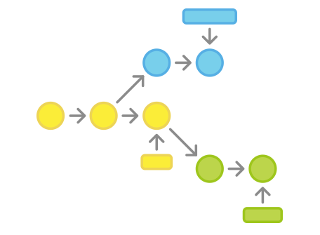

## 2.1 Centralized Workflow

If your team is already comfortable with `Subversion`, the Centralized Workflow lets you start benefiting from `Git` without changing how you work. It also serves as a gentle on-ramp to more Git-native workflows.
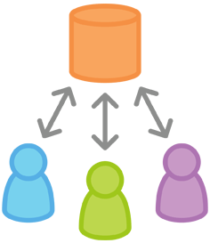

Switching to a distributed version control system can seem daunting, but you don't have to overhaul your workflow to enjoy `Git`'s benefits. A team can develop exactly the way they did with `Subversion`.

That said, using `Git` this way offers two significant advantages over `SVN`:

First, every developer gets a complete local copy of the entire project. This isolated environment means each developer's work is completely independent from others — they can commit freely to their local repo, ignoring upstream changes entirely until it's convenient to sync.

Second, `Git` offers a robust branching and merging model. Unlike `SVN`, `Git` branches are designed as a "fail-safe" mechanism for integrating code across repositories and sharing changes.

### 2.1.1 How It Works

Like `Subversion`, the Centralized Workflow uses a central repository as the single source of truth for all changes. Instead of `SVN`'s default `trunk` branch, `Git` uses `master`, and all changes are committed to this branch. This workflow only ever uses the one `master` branch.

Developers start by cloning the central repo. Within their local copy, they edit files and commit changes just like they would in `SVN` — but those changes exist only locally, completely isolated from the central repo. Developers can delay syncing with upstream until it's convenient.

When a developer is ready to publish their work, they push their local `master` branch to the central repo. This is equivalent to `svn commit`, except a `push` sends all local commits that aren't yet on the central repo.

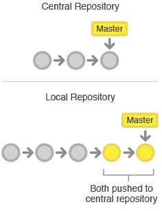

### 2.1.2 Conflict Resolution

The central repo represents the official project, so its commit history should be treated as stable and authoritative. If a developer's local history has diverged from the central repo, `Git` will refuse to push — otherwise it would overwrite commits that are already part of the official record.

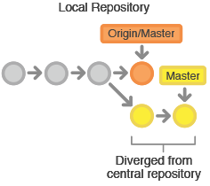

Before a developer can publish their changes, they need to `fetch` any new commits from the central repo and `rebase` their work on top of them.

This is effectively saying: "I want to add my changes on top of what everyone else has already done." The result is a perfectly linear history — just like the old SVN workflow.

If local changes conflict with upstream commits, `Git` will pause the rebase and give you a chance to resolve things manually. `Git` handles merge conflicts using the same [`git status`](https://www.atlassian.com/git/tutorial/git-basics#!status) and [`git add`](https://www.atlassian.com/git/tutorial/git-basics#!add) commands you already use to make commits — consistent and familiar. And if you get stuck, you can abort the entire rebase operation and start fresh (or ask someone else to help).

### 2.1.3 Example

Let's walk through how a small team uses this workflow. There are two developers — Xiao Ming and Xiao Hong — and we'll trace how they each develop their features and publish them to the central repo.

#### Someone Initializes the Central Repository


First, someone creates the central repository on a server. For a new project, initialize an empty repo; for an existing project, import the existing `Git` or `SVN` repository.

The central repository should be a bare repository (a `bare repository`), meaning it has no working directory. Create it with:

```bash
ssh user@host
git init --bare /path/to/repo.git
```

Fill in a valid `user` (the SSH username), `host` (the server's domain name or IP address), and `/path/to/repo.git` (where you want to store the repo).
By convention, bare repositories are given a `.git` extension to make their nature clear.

#### Everyone Clones the Central Repository

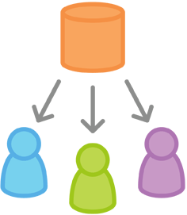

Next, each developer creates a local copy of the entire project using [`git clone`](https://www.atlassian.com/git/tutorial/git-basics#!clone):

```bash
git clone ssh://user@host/path/to/repo.git
```

When you clone a repository, `Git` automatically creates a remote alias called `origin` pointing back to the source — so you can easily interact with it going forward.

#### Xiao Ming Develops a Feature


In his local repo, Xiao Ming uses the standard `Git` process: edit, stage, and commit.
If you're not familiar with the staging area, here's a quick explanation: the **staging area** lets you prepare a commit without including every change in your working directory. This makes it easy to craft focused, atomic commits even when you have a lot of work in flight.

```bash
git status # check the state of your local repo
git add    # stage files
git commit # commit files
```

Since all these commands create local commits, Xiao Ming can run through this cycle as many times as he likes — the central repo is completely unaffected until he decides to push.
This is especially useful for large features that benefit from being broken into smaller, more atomic pieces.

#### Xiao Hong Develops a Feature


Meanwhile, Xiao Hong is doing the exact same thing in her own local repo — editing, staging, and committing. Like Xiao Ming, she has no idea whether the central repo has new commits, and she doesn't need to care about what he's doing in his local repo. All local repos are completely private.

#### Xiao Ming Publishes His Feature

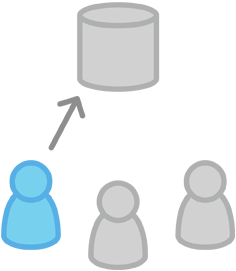

Once Xiao Ming finishes his feature, he publishes his local commits to the central repo so the rest of the team can see his work. He uses the [`git push`](https://www.atlassian.com/git/tutorial/remote-repositories#!push) command:

```bash
git push origin master
```

`origin` is the remote alias `Git` created when Xiao Ming cloned the repo. The `master` argument tells `Git` which branch to push.
Since the central repo hasn't been updated since Xiao Ming cloned it, the push completes without conflict.

#### Xiao Hong Tries to Publish Her Feature

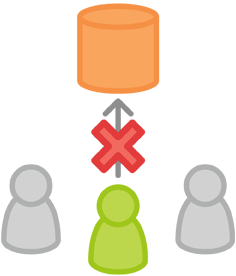

Now let's see what happens when Xiao Hong tries to push after Xiao Ming already has. She runs the same command:

```bash
git push origin master
```

But her local history has diverged from the central repo, and `Git` rejects the push with an error like this:

```
error: failed to push some refs to '/path/to/repo.git'
hint: Updates were rejected because the tip of your current branch is behind
hint: its remote counterpart. Merge the remote changes (e.g. 'git pull')
hint: before pushing again.
hint: See the 'Note about fast-forwards' in 'git push --help' for details.
```

This prevents Xiao Hong from overwriting Xiao Ming's official commits. She needs to pull his updates into her local repo, integrate them with her own work, and then try again.

#### Xiao Hong Rebases on Top of Xiao Ming's Commits

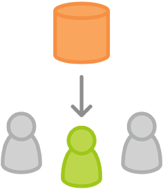

Xiao Hong uses [`git pull`](https://www.atlassian.com/git/tutorial/remote-repositories#!pull) to bring upstream changes into her local repo.
This is similar to `svn update` — it fetches all upstream commits into Xiao Hong's local repo and tries to merge them with her local changes:

```bash
git pull --rebase origin master
```

The `--rebase` option tells `Git` to move Xiao Hong's commits to the top of the updated `master` branch, as shown below:

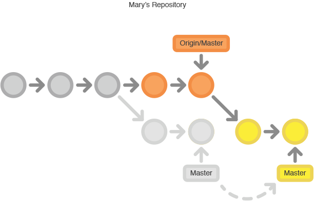

If you forget this option, the pull will still complete, but every sync from the central repo will generate an unnecessary "merge commit" at the end of your history.
For the Centralized Workflow, it's much cleaner to use `rebase` rather than creating merge commits.

#### Xiao Hong Resolves Merge Conflicts


During a rebase, commits are replayed one at a time on top of the updated `master` branch.
This means you resolve any conflicts one commit at a time — rather than dealing with one massive merge containing all changes at once.
This approach keeps each commit focused and the project history clean. It also makes it much easier to pinpoint where a bug was introduced, and minimizes the impact if you need to roll back a change.

If Xiao Hong and Xiao Ming's features don't touch the same files, there likely won't be any conflicts during the rebase. If there are, `Git` pauses at the conflicting commit and outputs:

```
CONFLICT (content): Merge conflict in <some-file>
```

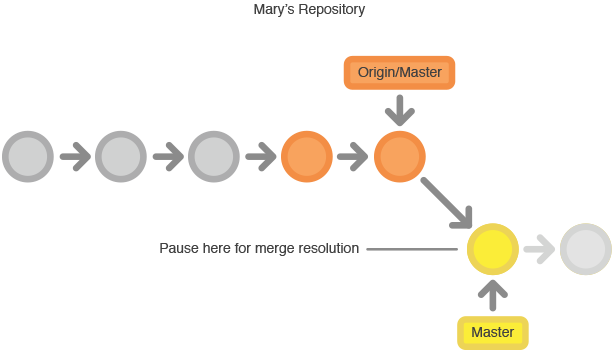

One of `Git`'s great strengths is that anyone can resolve their own conflicts. Xiao Hong can run [`git status`](https://www.atlassian.com/git/tutorial/git-basics#!status) to see exactly what's wrong.
Conflicted files appear in the `Unmerged paths` section:

```
# Unmerged paths:
# (use "git reset HEAD <some-file>..." to unstage)
# (use "git add/rm <some-file>..." as appropriate to mark resolution)
#
# both modified: <some-file>
```

Xiao Hong edits the conflicted files, then stages them and lets [`git rebase`](https://www.atlassian.com/git/tutorial/rewriting-git-history#!rebase) continue:

```bash
git add <some-file> 
git rebase --continue
```

That's it. `Git` will continue replaying commits, and if any others have conflicts, you repeat the process.

If you get into a conflict and realize you're stuck, don't panic. This command will take you right back to where you were before running [`git pull --rebase`](https://www.atlassian.com/git/tutorial/remote-repositories#!pull):

```bash
git rebase --abort
```

#### Xiao Hong Successfully Publishes Her Feature


Once Xiao Hong has synced with the central repo, her push goes through cleanly:

```bash
git push origin master
```

As you can see, a few `Git` commands are all you need to replicate the traditional `Subversion` workflow. This is great for teams migrating from `SVN`, but it doesn't take full advantage of what makes `Git` special.

If your team is comfortable with the Centralized Workflow but wants smoother collaboration, it's well worth exploring the Feature Branch Workflow.
Giving each feature its own dedicated branch makes it possible to have deep discussions before new work is integrated into the official project.

-----------------

## 2.2 Feature Branch Workflow

The Feature Branch Workflow builds on the Centralized Workflow by dedicating a separate branch to each new feature. This makes it possible to discuss and review changes — via Pull Requests — before integrating them into the official project.

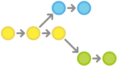

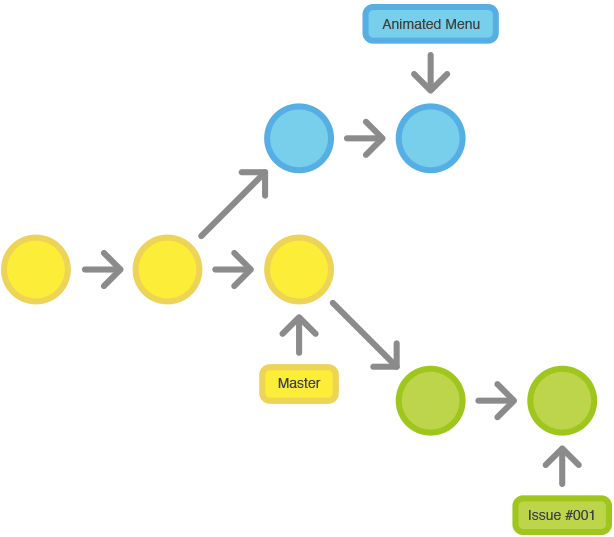

Once you're comfortable with the Centralized Workflow, adding feature branches is a natural next step. They encourage collaboration and make communication cleaner.

The core idea behind the Feature Branch Workflow is that all feature development should happen on a dedicated branch, never directly on `master`.
This isolation lets multiple developers work on different features simultaneously without getting in each other's way.
It also means the `master` branch never contains broken code — a huge benefit for continuous integration environments.

Feature isolation also enables the [pull requests](pull-request.md) workflow,
which lets any branch spark a discussion before it's merged into the official project, giving other developers a chance to weigh in.
If you get stuck on a feature, you can open a pull request and ask teammates for suggestions.
The key takeaway: pull requests make it easy for team members to give each other feedback on their work.

### 2.2.1 How It Works

The Feature Branch Workflow still uses a central repo, and `master` still represents the official project history.
But instead of committing directly to their local `master`, developers create a new branch every time they start a new feature.
Feature branches should have descriptive names — like `animated-menu-items` or `issue-#1061` — so their purpose is immediately clear.

From Git's perspective, there's no technical difference between a feature branch and `master`, so developers can edit, stage, and commit to a feature branch exactly the same way they would in the Centralized Workflow.

Feature branches should also be pushed to the central repo. This lets developers share their in-progress work with teammates without touching official code.
Since `master` is the only "special" branch, having many feature branches on the central repo causes no issues — and it gives everyone an offsite backup of their local commits.

### 2.2.2 Pull Requests

Feature branches don't just isolate development — they also make it possible to discuss changes through [Pull Requests](pull-request.md).
When a developer finishes a feature, instead of merging immediately into `master`, they push the feature branch to the central repo and open a Pull Request asking for it to be merged.
This gives the rest of the team a chance to review the changes before they become part of the mainline.

Code Review is one of the biggest benefits of Pull Requests, and Pull Requests are a natural forum for discussing code.
You can treat a Pull Request as a dedicated discussion thread for a specific branch. This means code review can happen earlier in the development cycle.
For example, if a developer needs help with a feature, they can open a Pull Request and the right people will be notified — and they can see exactly which commits need attention.

Once a Pull Request is accepted, publishing the feature works much the same as in the Centralized Workflow:
ensure the local `master` is in sync with upstream, merge the feature branch into local `master`, and push the updated `master` to the central repo.

Repository management products like [`Bitbucket`](http://bitbucket.org/) or [`Stash`](http://www.atlassian.com/stash) provide first-class Pull Request support. See the [`Stash` Pull Requests documentation](https://confluence.atlassian.com/display/STASH/Using+pull+requests+in+Stash) for details.

### 2.2.3 Example

The following example shows how Pull Requests can be used for Code Review, though Pull Requests can serve many other purposes as well.

#### Xiao Hong Starts Developing a New Feature


Before starting her feature, Xiao Hong needs a dedicated branch. She creates one with:

```bash
git checkout -b marys-feature master
```

This checks out a new branch called `marys-feature` based on `master`. The `-b` flag tells `Git` to create the branch if it doesn't already exist.
On this new branch, Xiao Hong follows her usual routine — edit, stage, commit — as many times as needed to build out the feature:

```bash
git status
git add <some-file>
git commit
```

#### Xiao Hong Goes to Lunch

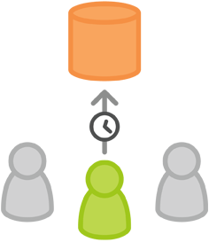

After adding several commits in the morning, Xiao Hong pushes her feature branch to the central repo before heading to lunch.
This is a good habit — it backs up her work, and if she's collaborating with others, it lets them see her commits.

```bash
git push -u origin marys-feature
```

This pushes `marys-feature` to the central repo (`origin`). The `-u` flag sets up tracking, so from now on she can just run `git push` without specifying the branch name.

#### Xiao Hong Finishes Her Feature


Back from lunch, Xiao Hong wraps up the feature. [Before merging into `master`](https://www.atlassian.com/git/tutorial/git-branches#!merge),
she opens a Pull Request to let the rest of the team know it's ready. First, she makes sure all her latest commits are on the central repo:

```bash
git push
```

Then, through her `Git` GUI client, she opens a Pull Request asking to merge `marys-feature` into `master`. The team is automatically notified.
One great thing about Pull Requests is that you can leave comments right next to specific commits, so reviewers can ask questions about particular changes.

#### Xiao Hei Receives the Pull Request

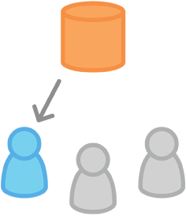

Xiao Hei reviews the changes in `marys-feature` after receiving the Pull Request. He decides whether any modifications are needed before merging, and he and Xiao Hong go back and forth through the Pull Request discussion.

#### Xiao Hong Makes More Changes


To make the requested changes, Xiao Hong follows the same process as the first iteration: edit, stage, commit, and push to the central repo. All her new activity shows up in the Pull Request, and Xiao Hei can continue reviewing.

If he needs to, Xiao Hei can also pull `marys-feature` locally, make changes himself, and push — those commits will show up in the Pull Request too.

#### Xiao Hong Publishes Her Feature


Once Xiao Hei approves the Pull Request, the feature can be merged into the stable codebase — either Xiao Hei or Xiao Hong can do this:

```bash
git checkout master
git pull
git pull origin marys-feature
git push
```

Whoever does the merge should first check out `master` and make sure it's up to date. Then `git pull origin marys-feature` merges `marys-feature` into the local `master` that's already in sync with the remote.
You could use `git merge marys-feature`, but the command above guarantees you're always working with the latest version of the feature branch.
Finally, the updated `master` gets pushed back to `origin`.

This process will often produce a merge commit. Some developers prefer this because it marks the point where a feature joined the codebase.
If you prefer a linear history, you can rebase the feature onto the tip of `master` before merging — this creates a fast-forward merge instead.

Some GUI clients automate the Pull Request acceptance process with a single "Accept" button.
If yours doesn't, it should at least automatically close the Pull Request once the feature branch is merged into `master`.

#### Meanwhile, Xiao Ming Is Doing the Same Thing

While Xiao Hong and Xiao Hei are working on `marys-feature` and discussing her Pull Request, Xiao Ming is doing exactly the same thing on his own feature branch.

By isolating features into separate branches, everyone can work independently. Sharing changes between developers when needed is still a bit of work, but everything stays organized.

At this point, you've hopefully seen how feature branches can support parallel feature development that would otherwise all have to happen on `master` in the Centralized Workflow.
Feature branches also make Pull Requests possible, enabling code discussions right in your version control GUI client.

The Feature Branch Workflow gives teams tremendous flexibility. The drawback is that it can sometimes be too flexible. Large teams often need branches with more clearly defined roles.
The Gitflow Workflow is the go-to pattern for managing feature development, release preparation, and maintenance together.

-----------------


## 2.3 Gitflow Workflow

The Gitflow Workflow assigns dedicated branches for feature development, release preparation, and maintenance — making the release cycle more predictable. Its strict branch model also provides the structure large projects need.

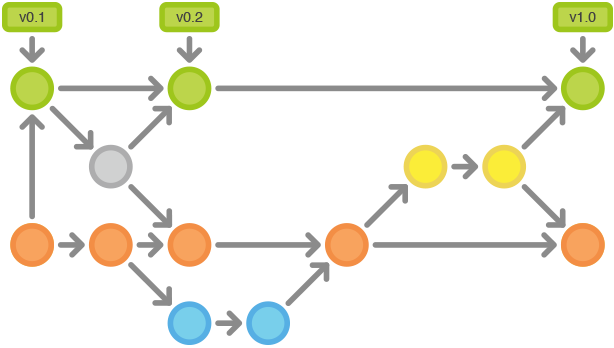

The [Gitflow Workflow](http://nvie.com/posts/a-successful-git-branching-model/) described here was originally published by *Vincent Driessen* at [nvie](http://nvie.com/).

Gitflow defines a strict branching model built around project releases. It's more involved than the Feature Branch Workflow, but provides a robust framework for managing larger projects.

Gitflow doesn't introduce new concepts or commands beyond what the Feature Branch Workflow uses. Instead, it assigns specific roles to different branches and defines when and how they interact.
In addition to feature branches, it defines dedicated branches for preparing, maintaining, and documenting releases.
And you still get everything from the Feature Branch Workflow: Pull Requests, isolated experimentation, and more efficient collaboration.

### 2.3.1 How It Works
Like the other workflows, Gitflow uses a central repo as the hub for all developer interaction. Developers work locally and push branches to the central repo.

### 2.3.2 Historical Branches

Instead of a single `master` branch, Gitflow uses two branches to record project history. The `master` branch stores the official release history, while the `develop` branch serves as the integration branch for features.
It also makes sense to tag all commits on `master` with a version number.

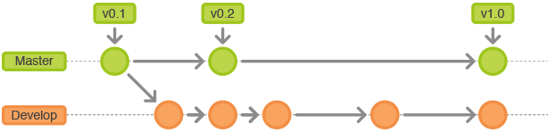

The rest of the workflow revolves around the distinction between these two branches.

### 2.3.3 Feature Branches

Each new feature lives on its own branch, which can be [pushed to the central repo for backup and collaboration](https://www.atlassian.com/git/tutorial/remote-repositories#!push).
But feature branches branch off `develop` rather than `master`, and when the feature is complete, they're [merged back into `develop`](https://www.atlassian.com/git/tutorial/git-branches#!merge).
Feature branches should never interact directly with `master`.

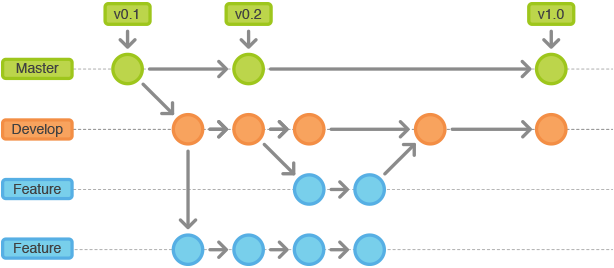

Note that feature branches plus the `develop` branch is essentially the Feature Branch Workflow. But Gitflow doesn't stop there.

### 2.3.4 Release Branches

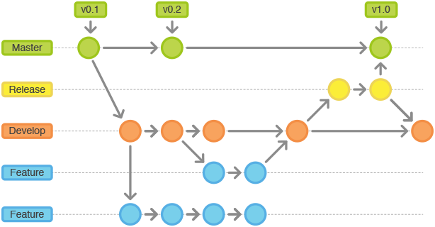

Once `develop` has accumulated enough features for a release (or a scheduled release date is approaching), you fork a release branch off of `develop`.
Creating this branch kicks off the next release cycle — from this point on, no new features can be added to this branch.
Only bug fixes, documentation updates, and other release-oriented tasks belong here.
Once the release is ready to ship, the release branch is merged into `master` and tagged with a version number.
All the changes made since the release branch was created also need to be merged back into `develop`.

Using a dedicated release preparation branch means one team can polish the current release while another team keeps developing the next version's features.
It also creates clear, well-defined development phases (for example, it becomes easy to say "this week we're preparing the 4.0 release" — and you can see that reflected directly in the repository structure).

Common branch naming conventions:

```
Branch off: develop
Merge into: master
Naming: release-* or release/*
```

### 2.3.5 Maintenance Branches

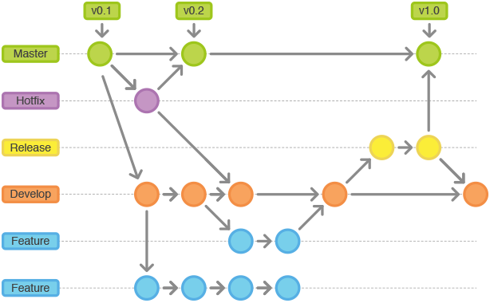

Maintenance branches — also called hotfix branches — are used to quickly patch production releases. This is the only branch type that forks directly from `master`.
Once the fix is complete, the changes should be merged immediately into both `master` and `develop` (or the current release branch), and `master` should be tagged with a new version number.

Having a dedicated branch for bug fixes lets the team address issues without interrupting other work or waiting for the next release cycle.
Think of a maintenance branch as an ad-hoc release that lives directly on top of `master`.

### 2.3.6 Example
The following example walks through how this workflow manages a single release cycle. Assume the central repository is already set up.

#### Create the Develop Branch


The first step is to create a `develop` branch alongside `master`. The simplest way is to [create an empty `develop` branch locally](https://www.atlassian.com/git/tutorial/git-branches#!branch) and push it to the server:

```bash
git branch develop
git push -u origin develop
```

This branch will eventually contain the project's full history, while `master` will contain only a subset. Other developers should [clone the central repo](https://www.atlassian.com/git/tutorial/git-basics#!clone) and set up a tracking branch for `develop`:

```bash
git clone ssh://user@host/path/to/repo.git
git checkout -b develop origin/develop
```

Now everyone has a local copy of both historical branches.

#### Xiao Hong and Xiao Ming Start New Features

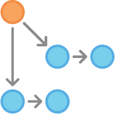

In this example, Xiao Hong and Xiao Ming each start working on their own features. They need to create separate branches. New branches should be [based off `develop`](https://www.atlassian.com/git/tutorial/git-branches#!checkout), not `master`:

```bash
git checkout -b some-feature develop
```

They add commits to their respective feature branches in the usual way — edit, stage, commit:
```bash
git status
git add <some-file>
git commit
```

#### Xiao Hong Finishes Her Feature

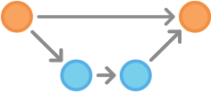

After completing her commits, Xiao Hong decides her feature is ready. If the team uses Pull Requests, this is the moment to open one for merging into `develop`.
Alternatively, she can merge directly into her local `develop` branch and push to the central repo:

```bash
git pull origin develop
git checkout develop
git merge some-feature
git push
git branch -d some-feature
```

The first command ensures `develop` is up to date before merging. Note that features should never be merged directly into `master`.
Conflict resolution works the same as in the Centralized Workflow.

#### Xiao Hong Prepares a Release


While Xiao Ming is still working on his feature, Xiao Hong starts preparing the project's first official release.
Like feature development, she uses a new branch for release preparation. This step also locks in the release version number:

```bash
git checkout -b release-0.1 develop
```

This branch is the place for cleaning up the release, running all tests, updating documentation, and any other release-oriented work — think of it as a dedicated branch for making the release ship-ready.

Once Xiao Hong creates this branch and pushes it to the central repo, the feature set for this release is frozen. Any new features not already in `develop` get pushed to the next release cycle.

#### Xiao Hong Completes the Release

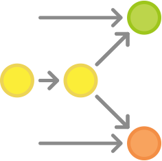

Once everything is ready to ship, Xiao Hong merges the release branch into both `master` and `develop`, then deletes it. Merging back into `develop` is important — any bug fixes made on the release branch need to be available in future features too.
If the team requires Code Review, this is also a great time to open a Pull Request.

```bash
git checkout master
git merge release-0.1
git push
git checkout develop
git merge release-0.1
git push
git branch -d release-0.1
```

The release branch acts as a buffer between feature development (the `develop` branch) and the public-facing release (the `master` branch). Every merge into `master` should be tagged for easy tracking:

```bash
git tag -a 0.1 -m "Initial public release" master
git push --tags
```

`Git` supports various hooks — scripts that run automatically when certain events happen in a repository.
You can configure a hook to automatically build and deploy a release every time you push to `master`.

#### An End User Discovers a Bug

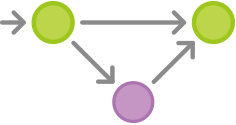

After shipping, Xiao Hong and Xiao Ming start working on the next version — until an end user files a ticket reporting a bug in the current release.
To address it, Xiao Hong (or Xiao Ming) forks a maintenance branch off `master`, commits a fix, and merges it directly back into `master`:

```bash
git checkout -b issue-#001 master
# Fix the bug
git checkout master
git merge issue-#001
git push
```

Just like release branches, critical fixes on a maintenance branch need to make it into `develop` too, so Xiao Hong performs a merge there as well. Then the branch can be safely [deleted](https://www.atlassian.com/git/tutorial/git-branches#!branch):

```bash
git checkout develop
git merge issue-#001
git push
git branch -d issue-#001
```

At this point, you should feel comfortable with the Centralized Workflow, the Feature Branch Workflow, and Gitflow.
You should also have a solid grasp of the power of local repositories, the push/pull model, and `Git`'s robust branching and merging capabilities.

Remember — the workflows shown here are examples of possible approaches, not inviolable rules.
Don't be afraid to adapt them to your needs. The goal is always to make `Git` work for you.

-----------------

## 2.4 Forking Workflow

The Forking Workflow is a distributed workflow that makes the most of `Git`'s branching and cloning capabilities. It can safely and reliably manage a large team of developers and even accept contributions from untrusted contributors.

What makes the Forking Workflow fundamentally different from the workflows we've discussed is that it doesn't rely on a single server-side repository as the "central" codebase. Instead, every developer has their own server-side repository. This means each contributor has not one but two `Git` repositories: a private local one and a public server-side one.

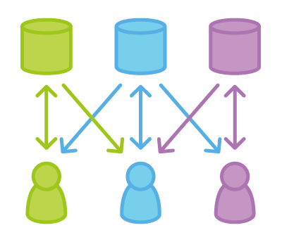

The Forking Workflow's main advantage is that contributions can be integrated without everyone needing push access to a single central repository.
Developers push to their own server-side repos, and only the project maintainer can push to the official repository.
This lets the maintainer accept commits from any developer without granting them write access to the official codebase.

The result is a distributed workflow that scales to large, loosely-organized teams — including untrusted third-party contributors.
It's also the ideal workflow for open source projects.

### 2.4.1 How It Works

Like other `Git` workflows, the Forking Workflow starts with an official, publicly accessible repository on a server.
But when a new developer wants to contribute, instead of cloning the official repo directly, they *fork* it — creating a copy on the server.

This copy is their personal public repository.
Other developers can't push to it, but they can pull from it (and as we'll see, that matters).
After creating their server-side copy, the developer clones it to their local machine using [`git clone`](https://www.atlassian.com/git/tutorial/git-basics#!clone) — just like in other workflows — to get a private development environment.

When they're ready to publish local changes, they push commits to their own public repo — not the official one.
Then they file a pull request to the official repo, letting the maintainer know their contribution is ready to review.
The pull request thread doubles as a handy discussion forum for the contributed code.

To integrate the feature into the official codebase, the maintainer pulls the contributor's changes into their local repo, reviews them to make sure everything looks good,
[merges them into local `master`](https://www.atlassian.com/git/tutorial/git-branches#!merge),
and then [`pushes`](https://www.atlassian.com/git/tutorial/remote-repositories#!push) `master` to the official server-side repository.
At that point, the contribution becomes part of the project, and other developers should pull the official repo to sync their local copies.

### 2.4.2 The Official Repository

In the Forking Workflow, the notion of an "official" repository is just a convention — it's important to understand this.
Technically, `Git` sees no difference between a developer's personal repo and the official one.
What makes the official repository official is simply that it belongs to the project maintainer.

### 2.4.3 Branching in the Forking Workflow

Personal public repositories are really just a convenient way to share branches with other developers.
Developers should still use branches to isolate individual features, just as they would in the [Feature Branch Workflow](workflow-feature-branch.md) or [Gitflow Workflow](workflow-forking.md).
The only difference is how those branches get shared. In the Forking Workflow, branches are pulled into another developer's local repo; in the other workflows, they're pushed directly to the official repository.

### 2.4.4 Example

#### The Maintainer Initializes the Official Repository


As with any `Git` project, the first step is to create an official repository on a server that all team members can access.
This repository typically also serves as the maintainer's public repo.

[Public repositories should be bare repositories](https://www.atlassian.com/git/tutorial/git-basics#!init) — whether or not they're the official codebase.
The project maintainer sets up the official repo with a command like:

```bash
ssh user@host
git init --bare /path/to/repo.git
```

`Bitbucket` and `Stash` provide a GUI that handles all of this for you.
Setting up the central repo works exactly the same as in the other workflows.
If an existing codebase exists, the maintainer should also push it to this repository.

#### Developers Fork the Official Repository


All other developers need to fork the official repository.
You can do this via `git clone` [using SSH to connect to the server](https://confluence.atlassian.com/display/BITBUCKET/Set+up+SSH+for+Git)
and copying the repository to a different location on the server — yes, a fork is essentially a server-side clone.
`Bitbucket` and `Stash` let developers fork with a single button click.

After this step, every developer has their own repository on the server. Like the official repo, these should be bare repositories.

#### Developers Clone Their Forked Repositories

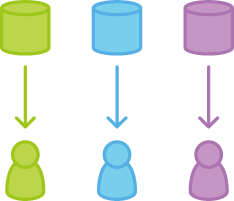

Next, each developer clones their personal public repository to their local machine using the familiar `git clone` command.

In this example, assume repositories are hosted on `Bitbucket`. Each developer will need their own Bitbucket account.
Clone your server-side repository like this:

```bash
git clone https://user@bitbucket.org/user/repo.git
```

While the other workflows only need one `origin` remote pointing to the central repo, the Forking Workflow needs two remotes —
one pointing to the official repo, and one pointing to the developer's personal server-side repo. These can be named anything, but the convention is to use `origin` for the personal clone
(created automatically by `git clone`) and `upstream` for the official repo.

```bash
git remote add upstream https://bitbucket.org/maintainer/repo
```

You need to create the `upstream` alias yourself. This makes it easy to keep your local repo in sync with the official project.
Note: if the upstream repository requires authentication (for example, if it's not open source), you'll need to include a username:

```bash
git remote add upstream https://user@bitbucket.org/maintainer/repo.git
```

With this setup, you'll need to supply a password whenever you clone from or pull the official repo.

#### Developers Work on Their Features


In their freshly cloned local repos, developers can edit code, [commit changes](https://www.atlassian.com/git/tutorial/git-basics#!commit), and [create branches](https://www.atlassian.com/git/tutorial/git-branches#!branch) just as they would in any other workflow:

```bash
git checkout -b some-feature
# Edit some code
git commit -a -m "Add first draft of some feature"
```

All changes remain private until they're pushed to the personal public repo. If the official project has moved ahead, developers can fetch new commits using [`git pull`](https://www.atlassian.com/git/tutorial/remote-repositories#!pull):

```bash
git pull upstream master
```

Since developers should always be working on a dedicated feature branch, this pull will result in a [fast-forward merge](https://www.atlassian.com/git/tutorial/git-branches#!merge).

#### Developers Publish Their Features

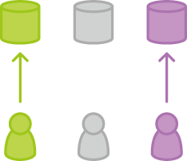

When a developer is ready to share a new feature, they need to do two things.
First, push the contribution to their own public repository so that other developers can access it.
Their `origin` remote should already be set up, so it's simply:

```bash
git push origin feature-branch
```

The key difference from other workflows is that `origin` points to the developer's personal server-side repo, not the official repo.

Second, the developer notifies the project maintainer that they want to merge their new feature into the official codebase.
`Bitbucket` and `Stash` provide a [Pull Request](https://confluence.atlassian.com/display/STASH/Using+pull+requests+in+Stash) button that pops up a form letting you specify which branch to merge into the official repository.
Typically you'll want to integrate your feature branch into the upstream remote's `master` branch.

#### The Maintainer Integrates the Contribution

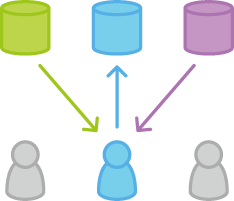

When the project maintainer receives a pull request, they decide whether to integrate it into the official codebase. There are two ways to do this:

1. Inspect the code directly in the pull request
2. Pull the code locally and merge it manually

Option one is simpler — the maintainer can review the diff in the GUI, add comments, and execute the merge.
But if there are merge conflicts, option two is necessary. In that case, the maintainer needs to [`fetch`](https://www.atlassian.com/git/tutorial/remote-repositories#!fetch) the feature branch from the developer's server-side repository,
merge it into their local `master`, and resolve any conflicts:

```bash
git fetch https://bitbucket.org/user/repo feature-branch
# Review the changes
git checkout master
git merge FETCH_HEAD
```

Once the changes are integrated into the local `master`, the maintainer pushes to the official repository so everyone can access them:

```bash
git push origin master
```

Note that the maintainer's `origin` points to their own public repository — which is the official project codebase. The contribution is now fully part of the project.

#### Developers Sync with the Official Repository

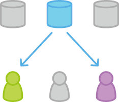

Since the official codebase has moved forward, other developers need to sync with it:

```bash
git pull upstream master
```

If you're coming from `SVN`, the Forking Workflow might feel like a radical paradigm shift.
But don't be intimidated — it's really just the Feature Branch Workflow with one additional layer of abstraction.
Instead of sharing branches through a single central repo, contributions are published to a developer's own server-side repository.

The example above traced how a contribution flows from a developer all the way to the official `master` branch, but the same approach can integrate contributions into any repository.
For instance, if a few team members are building a feature together, they can share changes between each other the same way — completely bypassing the official repository.

This is what makes the Forking Workflow such a powerful tool for loosely organized teams. Any developer can easily share changes with any other developer, and any branch can eventually be merged into the official codebase.

-----------------

## 2.5 Pull Requests

`Pull requests` are a `Bitbucket` feature that makes developer collaboration more convenient, providing a friendly web UI for discussing proposed changes before they're merged into the official project.


The simplest use of Pull Requests is as a notification mechanism: once a developer finishes a feature, they open a Pull Request via their `Bitbucket` account.
This signals everyone involved that the feature is ready for Code Review and merging into `master`.

But a Pull Request is much more than a simple notification — it's a dedicated forum for discussing the contributed feature.
If there are issues with the changes, team members can respond in the Pull Request, and even push new commits to refine the feature.
All of this activity is tracked directly in the Pull Request.

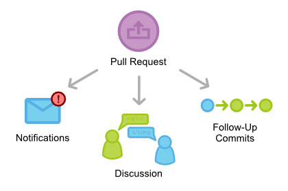

Compared to other collaboration models, this approach to sharing commits leads to a much smoother workflow.
Both `SVN` and `Git` can send notification emails via simple scripts, but when it comes to discussing changes, developers usually end up just replying to those emails.
That gets messy quickly, especially when later commits are involved.
Pull Requests centralize all relevant functionality into a single, user-friendly web interface that's deeply integrated with the `Bitbucket` repository.

### 2.5.1 Anatomy of a Pull Request

When you open a Pull Request, you're asking another developer (typically the project maintainer) to `pull` a branch from your repository into theirs. You need to provide four pieces of information: the source repository, the source branch, the target repository, and the target branch.

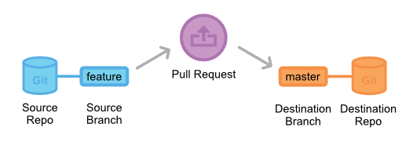

`Bitbucket` sets sensible defaults for most of these values. However, depending on your collaboration workflow, your team may need to specify different values.
The diagram above shows a Pull Request asking to merge a feature branch into the official `master` branch — but there are many other valid Pull Request configurations.

### 2.5.2 How It Works

A `Pull Request` can be used with the [Feature Branch Workflow](workflow-feature-branch.md), the [`Gitflow` Workflow](workflow-gitflow.md), or the [`Forking` Workflow](workflow-forking.md).
However, a Pull Request requires either different branches or different repositories, so it cannot be used directly with the [Centralized Workflow](workflow-centralized.md).
The exact process varies slightly across workflows, but the basic steps are always the same:

1. A developer creates a dedicated branch for their feature in their local repository.
2. The developer pushes the branch to a public `Bitbucket` repository.
3. The developer opens a Pull Request via `Bitbucket`.
4. The rest of the team reviews the code, discusses it, and suggests changes.
5. The project maintainer merges the feature into the official repository and closes the Pull Request.

The rest of this section explains how Pull Requests are used within different collaboration workflows.

### 2.5.3 Pull Requests in the Feature Branch Workflow

The Feature Branch Workflow uses a single shared `Bitbucket` repository for collaboration, with developers working on dedicated feature branches.
Instead of merging directly into `master`, developers open a Pull Request to start a discussion before the feature joins the main codebase.

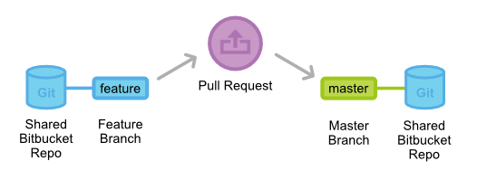

Since there's only one public repository in the Feature Branch Workflow, the Pull Request's source and target repositories are always the same.
Typically, a developer specifies their feature branch as the source and `master` as the target.

When a Pull Request arrives, the project maintainer decides what to do. If the feature looks good, it gets merged into `master` and the Pull Request is closed.
If there are problems, the maintainer can leave feedback in the Pull Request — and any new commits added afterward will automatically appear in the discussion.

It's also perfectly fine to open a Pull Request before a feature is fully finished.
If a developer runs into a problem, they can open a Pull Request with their work-in-progress and ask teammates for help.
Other developers can add suggestions in the thread, or even push commits directly to resolve the issue.

### 2.5.4 Pull Requests in the Gitflow Workflow

The Gitflow Workflow is similar to the Feature Branch Workflow, but defines a strict branching model around project releases.
Using Pull Requests in Gitflow gives developers a convenient place to discuss work on release or maintenance branches.

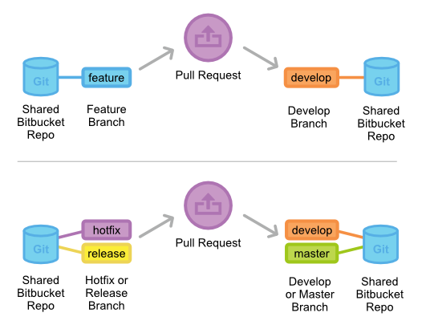

The Pull Request process in Gitflow works exactly the same as described above:
when a feature, release, or hotfix branch is ready for review, the developer opens a Pull Request,
and the rest of the team is notified via `Bitbucket`.

New features are generally merged into `develop`, while releases and hotfixes need to be merged into both `develop` and `master`.
Pull Requests can serve as the formal review gate for all merges.

### 2.5.5 Pull Requests in the Forking Workflow

In the Forking Workflow, developers push finished features to their own repositories rather than a shared one.
They then open a Pull Request to let the project maintainer know their feature is ready for review.

The notification aspect of Pull Requests is especially valuable here,
since the project maintainer has no way of knowing that another developer has added commits to their personal repository.

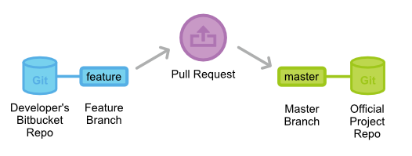

Because each developer has their own public repository, the source and target repositories in a Pull Request are different.
The source is the developer's public repository; the source branch is the branch containing the changes.
If the developer wants to merge into the official codebase, the target repository is the official repo and the target branch is `master`.

Pull Requests can also facilitate collaboration between developers outside the context of the official project.
For example, if two developers are building a feature together, one can open a Pull Request targeting the other's `Bitbucket` repository rather than the official one,
using the same feature branch as both source and target.

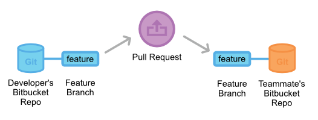

The two developers can discuss and iterate on the feature within the Pull Request.
When they're done, they can open another Pull Request to merge the feature into the official `master` branch.
This kind of flexibility is what makes Pull Requests such a powerful collaboration tool in the Forking Workflow.

### 2.5.6 Example

The following example shows how Pull Requests work in the Forking Workflow.
It applies equally to small team collaboration and to third-party developers contributing to open source projects.

In this scenario, Xiao Hong is a developer and Xiao Ming is the project maintainer. They each have a public `Bitbucket` repository, and Xiao Ming's contains the official project.

#### Xiao Hong Forks the Official Project

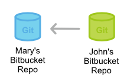

Xiao Hong starts by forking Xiao Ming's `Bitbucket` repository to begin working on the project. She logs into `Bitbucket`, navigates to Xiao Ming's repository page,
and clicks the `Fork` button.


She fills in a name and description for the forked repository, and now she has her own server-side copy of the project.

#### Xiao Hong Clones Her Bitbucket Repository

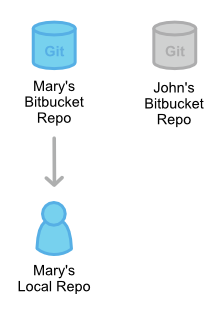

Next, Xiao Hong clones the `Bitbucket` repository she just forked to set up a local working copy on her machine:

```bash
git clone https://user@bitbucket.org/user/repo.git
```

Keep in mind that `git clone` automatically creates an `origin` remote alias pointing to Xiao Hong's forked repository.

#### Xiao Hong Develops a New Feature

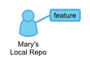

Before writing any code, Xiao Hong creates a new branch for her feature. This branch will be the source branch for her Pull Request.

```bash
git checkout -b some-feature
# Edit code
git commit -a -m "Add first draft of some feature"
```

On the feature branch, Xiao Hong adds commits as needed. If the commit history gets messy, she can use [interactive rebase](https://www.atlassian.com/git/tutorial/rewriting-git-history#!rebase-i) to clean it up.
For large projects, a tidy feature branch history makes it much easier for the maintainer to understand what changed in the Pull Request.

#### Xiao Hong Pushes Her Feature to Her Bitbucket Repository

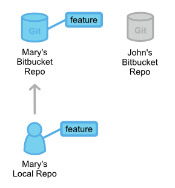

Once Xiao Hong finishes her feature, she pushes it to her own `Bitbucket` repository (not the official one) with a simple command:

```bash
git push origin some-branch
```

At this point, her changes are visible to the project maintainer (and any other collaborators who want to look).

#### Xiao Hong Opens a Pull Request

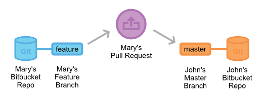

With her feature branch on `Bitbucket`, Xiao Hong navigates to her forked repository page and clicks the [**Pull Request**] button in the upper right to open a Pull Request.
The form pre-fills Xiao Hong's repository as the source, and asks her to specify the source branch, target repository, and target branch.

Since Xiao Hong wants to merge into the official repo, the source branch is her feature branch, the target repository is Xiao Ming's public repo,
and the target branch is `master`. She also provides a title and description for the Pull Request.
If she needs reviewers beyond Xiao Ming, she can add them in the Reviewers field.

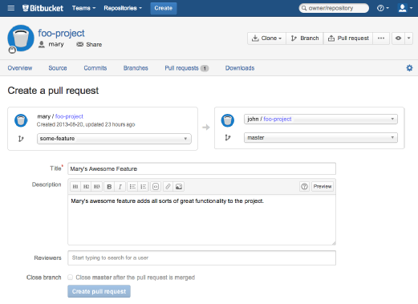

Once the Pull Request is created, Xiao Ming receives a notification via Bitbucket system message or email (optional).

#### Xiao Ming Reviews the Pull Request

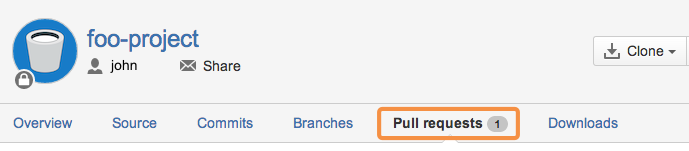

Xiao Ming can see all open Pull Requests on the [**Pull Request**] tab of his `Bitbucket` repository page.
Clicking on Xiao Hong's Pull Request shows its description, the feature's commit history, and a diff of every change.

If Xiao Ming wants to merge, he just clicks [**Merge**] to accept the Pull Request and bring it into `master`.

But in this example, Xiao Ming spots a small bug in Xiao Hong's code and wants it fixed before merging.
He can leave a comment on the entire Pull Request, or add an inline comment on a specific commit.

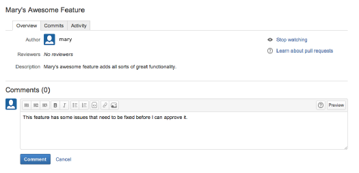

#### Xiao Hong Adds More Commits

If Xiao Hong has questions about the feedback, she can respond directly in the Pull Request — treating it as a discussion forum for her feature.

She adds new commits to her feature branch to address the code issues, then pushes them to her `Bitbucket` repository the same way she did before.
These commits automatically appear in the Pull Request, and Xiao Ming can review them alongside his original comments.

#### Xiao Ming Accepts the Pull Request

Finally, Xiao Ming accepts the changes, merges the feature branch into `master`, and closes the Pull Request.
The feature is now part of the project, and other developers can pull it into their local repositories with the standard `git pull` command.


At this point, you have everything you need to integrate Pull Requests into your own workflow.
Remember, Pull Requests are not meant to replace any Git-based collaboration workflow —
they're a useful complement that makes it easier for team members to work together.

-----------------

# Three: Enterprise Development Patterns

Before reading this section, we recommend reviewing the widely adopted [A Successful Git Branching Model](http://nvie.com/posts/a-successful-git-branching-model/) to understand common day-to-day development scenarios — it will help you follow the process described below.

In enterprise development, using `Git` as version control software is most powerful when combined with a self-hosted [Gitlab](https://about.gitlab.com/) instance that incorporates Code Review into the build and continuous integration pipeline. This way, before code is submitted for testing, it gets reviewed by peers — catching potential issues early, providing timely guidance, and helping new team members learn faster.

The requirements this model addresses:

- Support daily iterative development, urgent production bug fixes, and parallel development of multiple features
- Teams of around 50 people, with frequent short-cycle iterations (1–2 weeks per iteration)
- Ability to rebuild the entire system from a tag
- Support for code review
- All production code must be verified by testing, and automatically included in the next iteration
- Integration with the company's project management and CI systems

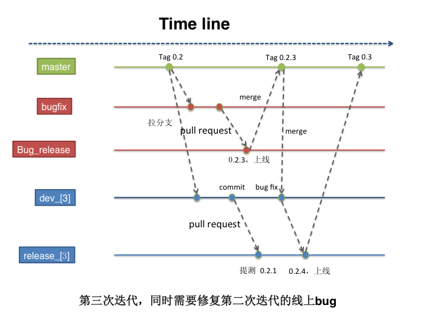

The diagram above shows the model xirong's team developed through daily practice — it's well-suited for enterprise development. The following is a brief walkthrough. Questions and improvements are welcome via GitHub Issues. (This model is designed for agile development with small, frequent releases; it has not been validated against traditional waterfall development.)

1. After sprint planning and kickoff meetings, the iteration's goals are finalized. The iteration is treated as a project: create a repository on Gitlab, initialize the codebase, and — based on the release date, say 2015-07-30 — create two branches: `release20150730` and `dev20150730`. The `dev` branch is the main development trunk; the `release` branch is for pre-testing builds and Code Review.

2. As the iteration begins and daily development proceeds, developers commit and push to the `dev` branch, resolving any collaboration conflicts along the way. When the code is ready for testing, whoever is submitting for testing first merges the latest master into the dev branch: `git merge --no-ff origin/master`, pulling in any master changes into the iteration's dev branch. Then they open a `pull request` on Gitlab, assign Code Review to the designated reviewer, and set the target branch to the release branch for this iteration — i.e., `release20150730`.

3. The designated Code Review person reviews the submitter's code. If everything looks good, the code proceeds to testing. If there are issues, the reviewer adds comments and the submitter makes corrections, repeating step 2 until the reviewer is satisfied. At that point, the code can be built and deployed to the test environment using the company's packaging and deployment tools.

4. After repeating steps 2–3 multiple times, a stable releasable version is reached. After going live, the last commit on the release branch (shown at the "0.2.4 release" point in the diagram) is merged into the master branch and tagged as `Tag0.3`. This completes one full iteration cycle.

5. If a bug in production is discovered shortly after release, branch off from the corresponding tag to create `release_bugfix_20150731` and `dev_bugfix_20150731`. Developers work on `dev_bugfix_20150731`; Code Review and pre-test builds happen on `release_bugfix_20150731`. Follow the same steps as 2–3. Once the test environment validates the fix, deploy to production. After confirming it works, merge into master and tag as `Tag0.2.3`. The bug fix is complete. The two purpose-built branches — `release_bugfix_20150731` and `dev_bugfix_20150731` — can now be deleted. (All historical commit information has already been merged into master — nothing is lost.)

Following steps 1–5 above handles code version control for enterprise iterative development effectively. Questions are welcome via Issues.

**November 2016 update** — Principles for the **Git Branch Development Model**:

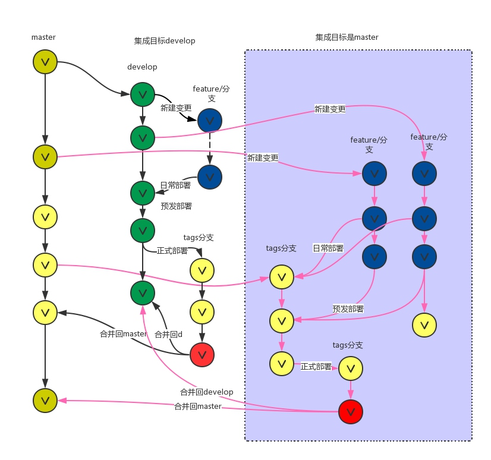

- **master**: Master always contains live production code. It's the most stable branch, holding code that's ready to deploy to production at any time. When a development cycle completes and a new deployable version is produced, code is merged into master only after a successful release — at which point master is updated. Once the deployment tool (aone2) is in use, write access to master is restricted for everyone.
- **develop**: The branch that holds the latest completed development work. Code on this branch is typically suitable for nightly builds, and write access is limited to the team lead.
- **feature**: Feature branches, one per feature — named `feature/<name>`. After development and self-testing, they're merged into `develop`.
- **hotfix**: Emergency bug fix branches. After going live, they can be merged directly into master.

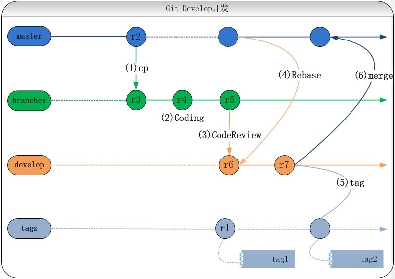

The Git-Develop branching model is a development approach built on top of Git that emphasizes strict control over release quality and cadence. `develop` serves as the fixed continuous integration and release branch, and code can only be merged into it after passing Code Review. The basic flow:

- Every requirement or change gets its own branch, forked from master.
- Developers do their work on this branch.
- Once the code meets the release criteria, a Code Review is submitted via the deployment tool. After the review passes, the code is automatically merged into the `develop` branch.
- Once all planned changes have been merged into `develop`, the system rebases master code onto `develop`, then kicks off its own build, package, and deploy process.
- After a successful release, the tool tags the deployed version of `develop` as a "current production version" baseline.
- After a successful release, the tool automatically merges the deployed version of `develop` back into master.

# Four: Discussion on Development Workflows
A few widely cited articles from the industry:
- [Gitflow Considered Harmful](http://insights.thoughtworkers.org/gitflow-consider-harmful/) — a Thoughtworks engineer's critique of Gitflow in practice. The comment thread sparked a lively debate — worth reading.
- [GitHub Flow](http://scottchacon.com/2011/08/31/github-flow.html) — scottchacon describes GitHub's day-to-day workflow in detail, explaining the reasoning behind each step.
- [How Google Manages Code](http://www.ruanyifeng.com/blog/2016/07/google-monolithic-source-repository.html) — Google and Facebook each maintain a single monorepo for the entire company. This article by Ruan Yifeng explains how and why.
- [Why Google Stores Billions of Lines of Code in a Single Repository](http://cacm.acm.org/magazines/2016/7/204032-why-google-stores-billions-of-lines-of-code-in-a-single-repository/fulltext)
