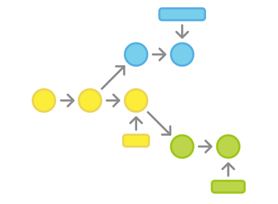
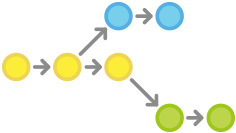
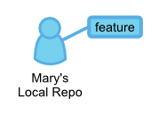
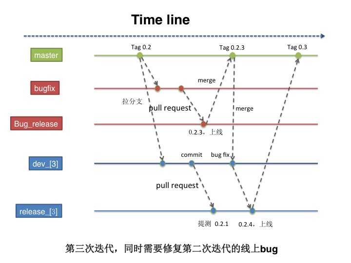
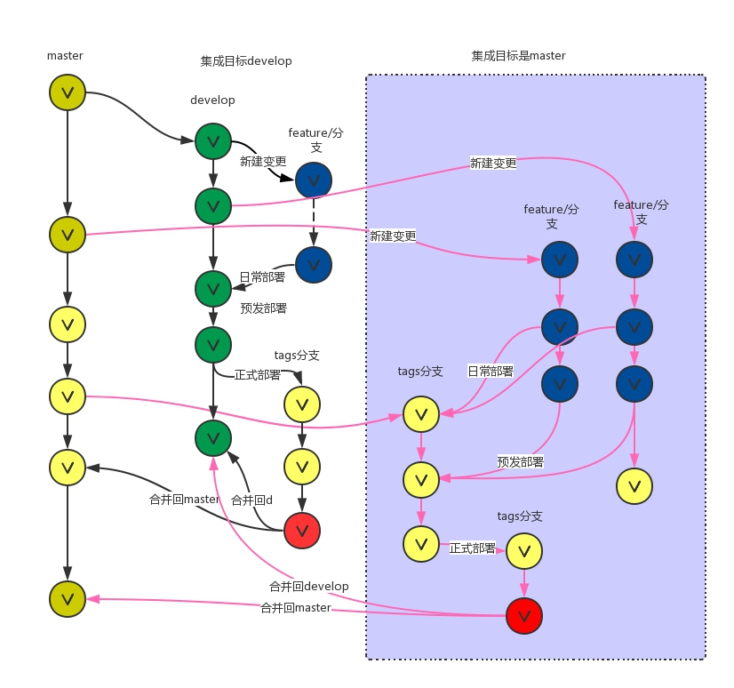

说明：
======
个人在学习`Git`工作流的过程中，从原有的 SVN 模式很难完全理解`Git`的协作模式，直到有一天我看到了下面的文章，好多遗留在心中的困惑迎刃而解：

- 我们以使用SVN的工作流来使用`Git`有什么不妥？
- `Git`方便的branch在哪里，团队多人如何协作？冲突了怎么办？如何进行发布控制？
- 经典的master-发布、develop-主开发、hotfix-bug修复如何避免代码不经过验证上线？
- 如何在`GitHub`上面与他人一起协作，star-fork-pull request是怎样的流程？

我个人很感激这篇文章，所以进行了整理，希望能帮到更多的人。整篇文章由 [xirong](https://github.com/xirong) 整理自 [oldratlee](https://github.com/oldratlee) 的`GitHub`，方便统一的学习回顾，在此感谢下面两位的贡献。

原文链接：[Git Workflows and Tutorials](https://www.atlassian.com/git/workflows)     
简体中文：由 [oldratlee](https://github.com/oldratlee) 翻译在 `GitHub` 上 [`Git`工作流指南](https://github.com/oldratlee/translations/blob/master/git-workflows-and-tutorials/README.md)

在第三部分 <a href="#三企业日常开发模式探索">企业日常开发模式探索</a>，xirong 结合自己所在公司使用git的版本分支开发过程，进行了总结，欢迎大家提出更好的建议。

在第四部分 <a href="#开发工作流的讨论">开发工作流的讨论</a> 中，引用了几篇文章，包括 Github 的开发流程以及 Thoughtworkers 工程师发表的「Gitflow 有害论」，旨在表名流程并不是唯一的，适合自己当前团队的才是最好的。

--------------

<p data-anchor-id="bd8d"><div class="toc">
<ul>
<li><a href="#一译序">一、译序</a></li>
<li><a href="#二git工作流指南">二、Git工作流指南</a><ul>
<li><a href="#21-集中式工作流">2.1 集中式工作流</a><ul>
<li><a href="#211-工作方式">2.1.1 工作方式</a></li>
<li><a href="#212-冲突解决">2.1.2 冲突解决</a></li>
<li><a href="#213-示例">2.1.3 示例</a><ul>
<li><a href="#有人先初始化好中央仓库">有人先初始化好中央仓库</a></li>
<li><a href="#所有人克隆中央仓库">所有人克隆中央仓库</a></li>
<li><a href="#小明开发功能">小明开发功能</a></li>
<li><a href="#小红开发功能">小红开发功能</a></li>
<li><a href="#小明发布功能">小明发布功能</a></li>
<li><a href="#小红试着发布功能">小红试着发布功能</a></li>
<li><a href="#小红在小明的提交之上rebase">小红在小明的提交之上rebase</a></li>
<li><a href="#小红解决合并冲突">小红解决合并冲突</a></li>
<li><a href="#小红成功发布功能">小红成功发布功能</a></li>
</ul>
</li>
</ul>
</li>
<li><a href="#22-功能分支工作流">2.2 功能分支工作流</a><ul>
<li><a href="#221-工作方式">2.2.1 工作方式</a></li>
<li><a href="#222-pull-requests">2.2.2 Pull Requests</a></li>
<li><a href="#223-示例">2.2.3 示例</a><ul>
<li><a href="#小红开始开发一个新功能">小红开始开发一个新功能</a></li>
<li><a href="#小红要去吃个午饭">小红要去吃个午饭</a></li>
<li><a href="#小红完成功能开发">小红完成功能开发</a></li>
<li><a href="#小黑收到pull-request">小黑收到Pull Request</a></li>
<li><a href="#小红再做修改">小红再做修改</a></li>
<li><a href="#小红发布她的功能">小红发布她的功能</a></li>
<li><a href="#与此同时小明在做和小红一样的事">与此同时，小明在做和小红一样的事</a></li>
</ul>
</li>
</ul>
</li>
<li><a href="#23-gitflow工作流">2.3 Gitflow工作流</a><ul>
<li><a href="#231-工作方式">2.3.1 工作方式</a></li>
<li><a href="#232-历史分支">2.3.2 历史分支</a></li>
<li><a href="#233-功能分支">2.3.3 功能分支</a></li>
<li><a href="#234-发布分支">2.3.4 发布分支</a></li>
<li><a href="#235-维护分支">2.3.5 维护分支</a></li>
<li><a href="#236-示例">2.3.6 示例</a><ul>
<li><a href="#创建开发分支">创建开发分支</a></li>
<li><a href="#小红和小明开始开发新功能">小红和小明开始开发新功能</a></li>
<li><a href="#小红完成功能开发-1">小红完成功能开发</a></li>
<li><a href="#小红开始准备发布">小红开始准备发布</a></li>
<li><a href="#小红完成发布">小红完成发布</a></li>
<li><a href="#最终用户发现bug">最终用户发现Bug</a></li>
</ul>
</li>
</ul>
</li>
<li><a href="#24-forking工作流">2.4 Forking工作流</a><ul>
<li><a href="#241-工作方式">2.4.1 工作方式</a></li>
<li><a href="#242-正式仓库">2.4.2 正式仓库</a></li>
<li><a href="#243-forking工作流的分支使用方式">2.4.3 Forking工作流的分支使用方式</a></li>
<li><a href="#244-示例">2.4.4 示例</a><ul>
<li><a href="#项目维护者初始化正式仓库">项目维护者初始化正式仓库</a></li>
<li><a href="#开发者fork正式仓库">开发者fork正式仓库</a></li>
<li><a href="#开发者克隆自己fork出来的仓库">开发者克隆自己fork出来的仓库</a></li>
<li><a href="#开发者开发自己的功能">开发者开发自己的功能</a></li>
<li><a href="#开发者发布自己的功能">开发者发布自己的功能</a></li>
<li><a href="#项目维护者集成开发者的功能">项目维护者集成开发者的功能</a></li>
<li><a href="#开发者和正式仓库做同步">开发者和正式仓库做同步</a></li>
</ul>
</li>
</ul>
</li>
<li><a href="#25-pull-requests">2.5 Pull Requests</a><ul>
<li><a href="#251-解析pull-request">2.5.1 解析Pull Request</a></li>
<li><a href="#252-工作方式">2.5.2 工作方式</a></li>
<li><a href="#253-在功能分支工作流中使用pull-request">2.5.3 在功能分支工作流中使用Pull Request</a></li>
<li><a href="#254-在gitflow工作流中使用pull-request">2.5.4 在Gitflow工作流中使用Pull Request</a></li>
<li><a href="#255-在forking工作流中使用pull-request">2.5.5 在Forking工作流中使用Pull Request</a></li>
<li><a href="#256-示例">2.5.6 示例</a><ul>
<li><a href="#小红fork正式项目">小红fork正式项目</a></li>
<li><a href="#小红克隆她的bitbucket仓库">小红克隆她的Bitbucket仓库</a></li>
<li><a href="#小红开发新功能">小红开发新功能</a></li>
<li><a href="#小红push功能到她的bitbucket仓库中">小红push功能到她的Bitbucket仓库中</a></li>
<li><a href="#小红发起pull-request">小红发起Pull Request</a></li>
<li><a href="#小明review-pull-request">小明review Pull Request</a></li>
<li><a href="#小红补加提交">小红补加提交</a></li>
<li><a href="#小明接受pull-request">小明接受Pull Request</a></li>
</ul>
</li>
</ul>
</li>
</ul>
</li>
<li><a href="#三企业日常开发模式探索">三、企业日常开发模式探索</a></li>
</ul>
</div>
</p>


# 一、译序

这篇指南以大家在`SVN`中已经广为熟悉使用的集中式工作流作为起点，循序渐进地演进到其它高效的分布式工作流，还介绍了如何配合使用便利的`Pull Request`功能，系统地讲解了各种工作流的应用。
如果你`Git`用的还不多，可以从前面的讲的工作流开始操练。在操作过程中去感受指南的讲解：解决什么问题、如何解决问题，这样理解就深了，也方便活用。

行文中实践原则和操作示例并重，对于`Git`的资深玩家可以梳理思考提升，而新接触的同学，也可以跟着step-by-step操练学习并在实际工作中上手使用。

工作流其实不是一个初级主题，背后的本质问题是 有效的项目流程管理 和 高效的开发协同约定，而不仅仅是`Git`或`SVN`等[`VCS`](http://zh.wikipedia.org/wiki/%E7%89%88%E6%9C%AC%E6%8E%A7%E5%88%B6)或[`SCM`](http://zh.wikipedia.org/wiki/%E8%BD%AF%E4%BB%B6%E9%85%8D%E7%BD%AE%E7%AE%A1%E7%90%86)工具的使用。

关于`Git`工作流主题，网上体系的中文资料不多，主要是零散的操作说明，希望这篇文章能让你更深入理解并在工作中灵活有效地使用起来。

`Gitflow`工作流是经典模型，处于核心位置，体现了工作流的经验和精髓。随着项目过程复杂化，你会感受到这个工作流中的深思熟虑和威力！

`Forking`工作流是分布式协作的（`GitHub`风格）可以先看看`GitHub`的Help：[Fork A Repo](https://help.github.com/articles/fork-a-repo/)和[Using pull requests](https://help.github.com/articles/using-pull-requests/) 。照着操作，给一个`GitHub`项目贡献你的提交，有操作经验再看指南容易意会。指南中给了[自己实现`Fork`的方法](https://github.com/oldratlee/translations/blob/master/git-workflows-and-tutorials/workflow-forking.md#%E5%BC%80%E5%8F%91%E8%80%85fork%E6%AD%A3%E5%BC%8F%E4%BB%93%E5%BA%93)：`Fork`就是服务端的克隆。在指南的操练中使用代码托管服务（如`GitHub`、`Bitbucket`），可以点一下按钮就让开发者完成仓库的`fork`操作。

**_PS_**：

文中`Pull Request`的介绍用的是`Bitbucket`代码托管服务，由于和`GitHub`基本一样，如果你用的是`GitHub`（我自己也主要使用`GitHub`托管代码），不影响理解和操作。

**_PPS_**：

更多`Git`学习资料参见

- [`Git`的资料整理](https://github.com/xirong/my-git) by [@xirong](https://github.com/xirong)
- 自己整理的分享PPT [`Git`使用与实践](https://github.com/oldratlee/software-practice-miscellany/blob/master/git/git-gitlab-usage.pptx) @ [个人整理一些`Git`](https://github.com/oldratlee/software-practice-miscellany/tree/master/git)

----------------

- :see_no_evil: [自己](http://weibo.com/oldratlee)理解粗浅，翻译中不足和不对之处，欢迎 :clap:
    - 建议，[提交`Issue`](https://github.com/oldratlee/translations/issues/new)
    - 指正，[`Fork`后提通过`Pull Requst`贡献修改](https://github.com/oldratlee/translations/fork)
- 如有文章理解上有疑问 或是 使用过程中碰到些疑惑，请随时:raised_hands:[提交`Issue`](https://github.com/oldratlee/translations/issues/new) ，一起交流学习讨论！

----------------


# 二、`Git`工作流指南

:point_right: 工作流有各式各样的用法，但也正因此使得在实际工作中如何上手使用变得很头大。这篇指南通过总览公司团队中最常用的几种`Git`工作流让大家可以上手使用。

在阅读的过程中请记住，本文中的几种工作流是作为方案指导而不是条例规定。在展示了各种工作流可能的用法后，你可以从不同的工作流中挑选或揉合出一个满足你自己需求的工作流。



## 2.1 集中式工作流

如果你的开发团队成员已经很熟悉`Subversion`，集中式工作流让你无需去适应一个全新流程就可以体验`Git`带来的收益。这个工作流也可以作为向更`Git`风格工作流迁移的友好过渡。


转到分布式版本控制系统看起来像个令人生畏的任务，但不改变已用的工作流，你也可以用上`Git`带来的收益。团队可以用和`Subversion`完全不变的方式来开发项目。

但使用`Git`加强开发的工作流，相比`SVN`，`Git`有以下两个优势:
首先，每个开发者可以有属于自己的整个工程的本地拷贝。隔离的环境让各个开发者的工作和项目的其他部分修改独立开来 ——
即自由地提交到自己的本地仓库，先完全忽略上游的开发，直到方便的时候再把修改反馈上去。

其次，`Git`提供了强壮的分支和合并模型。不像`SVN`，`Git`的分支设计成可以做为一种用来在仓库之间集成代码和分享修改的『失败安全』的机制。

### 2.1.1 工作方式

像`Subversion`一样，集中式工作流以中央仓库作为项目所有修改的单点实体。相比`SVN`缺省的开发分支`trunk`，`Git`叫做`master`，所有修改提交到这个分支上。本工作流只用到`master`这一个分支。

首先，开发者克隆中央仓库。在自己的项目拷贝中，像`SVN`一样的编辑文件和提交修改；但修改是存在本地的，和中央仓库是完全隔离的。开发者可以把和上游的同步延后到一个方便时间点。

然后，开发者发布修改到正式项目中，开发者要把本地`master`分支的修改『推』到中央仓库中。这相当于`svn commit`操作，但`push`操作会把所有还不在中央仓库的本地提交都推上去。


### 2.1.2 冲突解决

中央仓库代表了正式项目，所以提交历史应该被尊重且是稳定不变的。如果开发者本地的提交历史和中央仓库有分歧，`Git`会拒绝`push`提交否则会覆盖已经在中央库的正式提交。


在开发者提交自己功能修改到中央库前，需要先`fetch`在中央库的新增提交，`rebase`自己提交到中央库提交历史之上。
这样做的意思是在说，『我要把自己的修改加到别人已经完成的修改上。』最终的结果是一个完美的线性历史，就像以前的`SVN`的工作流中一样。

如果本地修改和上游提交有冲突，`Git`会暂停`rebase`过程，给你手动解决冲突的机会。`Git`解决合并冲突，用和生成提交一样的[`git status`](https://www.atlassian.com/git/tutorial/git-basics#!status)和[`git add`](https://www.atlassian.com/git/tutorial/git-basics#!add)命令，很一致方便。还有一点，如果解决冲突时遇到麻烦，`Git`可以很简单中止整个`rebase`操作，重来一次（或者让别人来帮助解决）。

### 2.1.3 示例

让我们一起逐步分解来看看一个常见的小团队如何用这个工作流来协作的。有两个开发者小明和小红，看他们是如何开发自己的功能并提交到中央仓库上的。

#### 有人先初始化好中央仓库


第一步，有人在服务器上创建好中央仓库。如果是新项目，你可以初始化一个空仓库；否则你要导入已有的`Git`或`SVN`仓库。

中央仓库应该是个裸仓库（`bare repository`），即没有工作目录（`working directory`）的仓库。可以用下面的命令创建：

```bash
ssh user@host
git init --bare /path/to/repo.git
```

确保写上有效的`user`（`SSH`的用户名），`host`（服务器的域名或IP地址），`/path/to/repo.git`（你想存放仓库的位置）。
注意，为了表示是一个裸仓库，按照约定加上`.git`扩展名到仓库名上。

#### 所有人克隆中央仓库


下一步，各个开发者创建整个项目的本地拷贝。通过[`git clone`](https://www.atlassian.com/git/tutorial/git-basics#!clone)命令完成：

```bash
git clone ssh://user@host/path/to/repo.git
```

基于你后续会持续和克隆的仓库做交互的假设，克隆仓库时`Git`会自动添加远程别名`origin`指回『父』仓库。

#### 小明开发功能


在小明的本地仓库中，他使用标准的`Git`过程开发功能：编辑、暂存（`Stage`）和提交。
如果你不熟悉暂存区（`Staging Area`），这里说明一下：**暂存区**用来准备一个提交，但可以不用把工作目录中所有的修改内容都包含进来。
这样你可以创建一个高度聚焦的提交，尽管你本地修改很多内容。

```bash
git status # 查看本地仓库的修改状态
git add # 暂存文件
git commit # 提交文件
```

请记住，因为这些命令生成的是本地提交，小明可以按自己需求反复操作多次，而不用担心中央仓库上有了什么操作。
对需要多个更简单更原子分块的大功能，这个做法是很有用的。


#### 小红开发功能


与此同时，小红在自己的本地仓库中用相同的编辑、暂存和提交过程开发功能。和小明一样，她也不关心中央仓库有没有新提交；
当然更不关心小明在他的本地仓库中的操作，因为所有本地仓库都是私有的。

#### 小明发布功能


一旦小明完成了他的功能开发，会发布他的本地提交到中央仓库中，这样其它团队成员可以看到他的修改。他可以用下面的[`git push`命令](https://www.atlassian.com/git/tutorial/remote-repositories#!push)：

```bash
git push origin master
```

注意，`origin`是在小明克隆仓库时`Git`创建的远程中央仓库别名。`master`参数告诉`Git`推送的分支。
由于中央仓库自从小明克隆以来还没有被更新过，所以`push`操作不会有冲突，成功完成。

#### 小红试着发布功能


一起来看看在小明发布修改后，小红`push`修改会怎么样？她使用完全一样的`push`命令：

```bash
git push origin master
```

但她的本地历史已经和中央仓库有分岐了，`Git`拒绝操作并给出下面很长的出错消息：

```
error: failed to push some refs to '/path/to/repo.git'
hint: Updates were rejected because the tip of your current branch is behind
hint: its remote counterpart. Merge the remote changes (e.g. 'git pull')
hint: before pushing again.
hint: See the 'Note about fast-forwards' in 'git push --help' for details.
```

这避免了小红覆写正式的提交。她要先`pull`小明的更新到她的本地仓库合并上她的本地修改后，再重试。

#### 小红在小明的提交之上`rebase`


小红用[`git pull`](https://www.atlassian.com/git/tutorial/remote-repositories#!pull)合并上游的修改到自己的仓库中。
这条命令类似`svn update`——拉取所有上游提交命令到小红的本地仓库，并尝试和她的本地修改合并：

```bash
git pull --rebase origin master
```

`--rebase`选项告诉`Git`把小红的提交移到同步了中央仓库修改后的`master`分支的顶部，如下图所示：


如果你忘加了这个选项，`pull`操作仍然可以完成，但每次`pull`操作要同步中央仓库中别人修改时，提交历史会以一个多余的『合并提交』结尾。
对于集中式工作流，最好是使用`rebase`而不是生成一个合并提交。

#### 小红解决合并冲突


`rebase`操作过程是把本地提交一次一个地迁移到更新了的中央仓库`master`分支之上。
这意味着可能要解决在迁移某个提交时出现的合并冲突，而不是解决包含了所有提交的大型合并时所出现的冲突。
这样的方式让你尽可能保持每个提交的聚焦和项目历史的整洁。反过来，简化了哪里引入`Bug`的分析，如果有必要，回滚修改也可以做到对项目影响最小。

如果小红和小明的功能是不相关的，不大可能在`rebase`过程中有冲突。如果有，`Git`在合并有冲突的提交处暂停`rebase`过程，输出下面的信息并带上相关的指令：

```
CONFLICT (content): Merge conflict in <some-file>
```


`Git`很赞的一点是，任何人可以解决他自己的冲突。在这个例子中，小红可以简单的运行[`git status`](https://www.atlassian.com/git/tutorial/git-basics#!status)命令来查看哪里有问题。
冲突文件列在`Unmerged paths`（未合并路径）一节中：

```
# Unmerged paths:
# (use "git reset HEAD <some-file>..." to unstage)
# (use "git add/rm <some-file>..." as appropriate to mark resolution)
#
# both modified: <some-file>
```

接着小红编辑这些文件。修改完成后，用老套路暂存这些文件，并让[`git rebase`](https://www.atlassian.com/git/tutorial/rewriting-git-history#!rebase)完成剩下的事：

```bash
git add <some-file> 
git rebase --continue
```

要做的就这些了。`Git`会继续一个一个地合并后面的提交，如其它的提交有冲突就重复这个过程。

如果你碰到了冲突，但发现搞不定，不要惊慌。只要执行下面这条命令，就可以回到你执行[`git pull --rebase`](https://www.atlassian.com/git/tutorial/remote-repositories#!pull)命令前的样子：

```bash
git rebase --abort
```

#### 小红成功发布功能


小红完成和中央仓库的同步后，就能成功发布她的修改了：

```bash
git push origin master
```

如你所见，仅使用几个`Git`命令我们就可以模拟出传统`Subversion`开发环境。对于要从`SVN`迁移过来的团队来说这太好了，但没有发挥出`Git`分布式本质的优势。

如果你的团队适应了集中式工作流，但想要更流畅的协作效果，绝对值得探索一下 `功能分支工作流` 的收益。
通过为一个功能分配一个专门的分支，能够做到一个新增功能集成到正式项目之前对新功能进行深入讨论。

-----------------

## 2.2 功能分支工作流

功能分支工作流以集中式工作流为基础，不同的是为各个新功能分配一个专门的分支来开发。这样可以在把新功能集成到正式项目前，用`Pull Requests`的方式讨论变更。




一旦你玩转了[集中式工作流](workflow-centralized.md)，在开发过程中可以很简单地加上功能分支，用来鼓励开发者之间协作和简化交流。

功能分支工作流背后的核心思路是所有的功能开发应该在一个专门的分支，而不是在`master`分支上。
这个隔离可以方便多个开发者在各自的功能上开发而不会弄乱主干代码。
另外，也保证了`master`分支的代码一定不会是有问题的，极大有利于集成环境。

功能开发隔离也让[`pull requests`工作流](pull-request.md)成功可能，
`pull requests`工作流能为每个分支发起一个讨论，在分支合入正式项目之前，给其它开发者有表示赞同的机会。
另外，如果你在功能开发中有问题卡住了，可以开一个`pull requests`来向同学们征求建议。
这些做法的重点就是，`pull requests`让团队成员之间互相评论工作变成非常方便！

### 2.2.1 工作方式

功能分支工作流仍然用中央仓库，并且`master`分支还是代表了正式项目的历史。
但不是直接提交本地历史到各自的本地`master`分支，开发者每次在开始新功能前先创建一个新分支。
功能分支应该有个有描述性的名字，比如`animated-menu-items`或`issue-#1061`，这样可以让分支有个清楚且高聚焦的用途。

对于`master`分支和功能分支，`Git`是没有技术上的区别，所以开发者可以用和集中式工作流中完全一样的方式编辑、暂存和提交修改到功能分支上。

另外，功能分支也可以（且应该）`push`到中央仓库中。这样不修改正式代码就可以和其它开发者分享提交的功能。
由于`master`是仅有的一个『特殊』分支，在中央仓库上存多个功能分支不会有任何问题。当然，这样做也可以很方便地备份各自的本地提交。

### 2.2.2 `Pull Requests`

功能分支除了可以隔离功能的开发，也使得通过[`Pull Requests`](pull-request.md)讨论变更成为可能。
一旦某个开发者完成一个功能，不是立即合并到`master`，而是`push`到中央仓库的功能分支上并发起一个`Pull Request`请求，将修改合并到`master`。
在修改成为主干代码前，这让其它的开发者有机会先去`Review`变更。

`Code Review`是`Pull Requests`的一个重要的收益，而`Pull Requests`则是讨论代码的一个通用方式。
你可以把`Pull Requests`作为专门给某个分支的讨论。这意味着可以在更早的开发过程中就可以进行`Code Review`。
比如，一个开发者开发功能需要帮助时，要做的就是发起一个`Pull Request`，相关的人就会自动收到通知，在相关的提交旁边能看到需要帮助解决的问题。

一旦`Pull Request`被接受了，发布功能要做的就和集中式工作流就很像了。
首先，确定本地的`master`分支和上游的`master`分支是同步的。然后合并功能分支到本地`master`分支并`push`已经更新的本地`master`分支到中央仓库。

仓库管理的产品解决方案像[`Bitbucket`](http://bitbucket.org/)或[`Stash`](http://www.atlassian.com/stash)，可以良好地支持`Pull Requests`。可以看看`Stash`的[`Pull Requests`文档](https://confluence.atlassian.com/display/STASH/Using+pull+requests+in+Stash)。

### 2.2.3 示例

下面的示例演示了如何把`Pull Requests`作为`Code Review`的方式，但注意`Pull Requests`可以用于很多其它的目的。

#### 小红开始开发一个新功能


在开始开发功能前，小红需要一个独立的分支。使用下面的命令[新建一个分支](https://www.atlassian.com/git/tutorial/git-branches#!checkout)：

```bash
git checkout -b marys-feature master
```

这个命令检出一个基于`master`名为`marys-feature`的分支，`Git`的`-b`选项表示如果分支还不存在则新建分支。
这个新分支上，小红按老套路编辑、暂存和提交修改，按需要提交以实现功能：

```bash
git status
git add <some-file>
git commit
```

#### 小红要去吃个午饭


早上小红为新功能添加一些提交。
去吃午饭前，`push`功能分支到中央仓库是很好的做法，这样可以方便地备份，如果和其它开发协作，也让他们可以看到小红的提交。

```bash
git push -u origin marys-feature
```

这条命令`push` `marys-feature`分支到中央仓库（`origin`），`-u`选项设置本地分支去跟踪远程对应的分支。
设置好跟踪的分支后，小红就可以使用`git push`命令省去指定推送分支的参数。

#### 小红完成功能开发


小红吃完午饭回来，完成整个功能的开发。[在合并到`master`之前](https://www.atlassian.com/git/tutorial/git-branches#!merge)，
她发起一个`Pull Request`让团队的其它人知道功能已经完成。但首先，她要确认中央仓库中已经有她最近的提交：

```bash
git push
```

然后，在她的`Git` `GUI`客户端中发起`Pull Request`，请求合并`marys-feature`到`master`，团队成员会自动收到通知。
`Pull Request`很酷的是可以在相关的提交旁边显示评注，所以你可以对某个变更集提问。

#### 小黑收到`Pull Request`


小黑收到了`Pull Request`后会查看`marys-feature`的修改。决定在合并到正式项目前是否要做些修改，且通过`Pull Request`和小红来回地讨论。

#### 小红再做修改


要再做修改，小红用和功能第一个迭代完全一样的过程。编辑、暂存、提交并`push`更新到中央仓库。小红这些活动都会显示在`Pull Request`上，小黑可以断续做评注。

如果小黑有需要，也可以把`marys-feature`分支拉到本地，自己来修改，他加的提交也会一样显示在`Pull Request`上。

#### 小红发布她的功能


一旦小黑可以的接受`Pull Request`，就可以合并功能到稳定项目代码中（可以由小黑或是小红来做这个操作）：

```bash
git checkout master
git pull
git pull origin marys-feature
git push
```

无论谁来做合并，首先要检出`master`分支并确认是它是最新的。然后执行`git pull origin marys-feature`合并`marys-feature`分支到和已经和远程一致的本地`master`分支。
你可以使用简单`git merge marys-feature`命令，但前面的命令可以保证总是最新的新功能分支。
最后更新的`master`分支要重新`push`回到`origin`。

这个过程常常会生成一个合并提交。有些开发者喜欢有合并提交，因为它像一个新功能和原来代码基线的连通符。
但如果你偏爱线性的提交历史，可以在执行合并时`rebase`新功能到`master`分支的顶部，这样生成一个快进（`fast-forward`）的合并。

一些`GUI`客户端可以只要点一下『接受』按钮执行好上面的命令来自动化`Pull Request`接受过程。
如果你的不能这样，至少在功能合并到`master`分支后能自动关闭`Pull Request`。

#### 与此同时，小明在做和小红一样的事

当小红和小黑在`marys-feature`上工作并讨论她的`Pull Request`的时候，小明在自己的功能分支上做完全一样的事。

通过隔离功能到独立的分支上，每个人都可以自主的工作，当然必要的时候在开发者之间分享变更还是比较繁琐的。

到了这里，但愿你发现了功能分支可以很直接地在 `集中式工作流` 的仅有的`master`分支上完成多功能的开发。
另外，功能分支还使用了`Pull Request`，使得可以在你的版本控制`GUI`客户端中讨论某个提交。

功能分支工作流是开发项目异常灵活的方式。问题是，有时候太灵活了。对于大型团队，常常需要给不同分支分配一个更具体的角色。
`Gitflow`工作流是管理功能开发、发布准备和维护的常用模式。

-----------------


## 2.3 `Gitflow`工作流

`Gitflow`工作流通过为功能开发、发布准备和维护分配独立的分支，让发布迭代过程更流畅。严格的分支模型也为大型项目提供了一些非常必要的结构。


这节介绍的[`Gitflow`工作流](http://nvie.com/posts/a-successful-git-branching-model/)借鉴自在[nvie](http://nvie.com/)的*Vincent Driessen*。

`Gitflow`工作流定义了一个围绕项目发布的严格分支模型。虽然比[功能分支工作流](workflow-feature-branch.md)复杂几分，但提供了用于一个健壮的用于管理大型项目的框架。

`Gitflow`工作流没有用超出功能分支工作流的概念和命令，而是为不同的分支分配一个明确的角色，并定义分支之间如何和什么时候进行交互。
除了使用功能分支，在做准备、维护和记录发布时，也定义了各自的分支。
当然你可以用上功能分支工作流所有的好处：`Pull Requests`、隔离实验性开发和更高效的协作。

### 2.3.1 工作方式
`Gitflow`工作流仍然用中央仓库作为所有开发者的交互中心。和其它的工作流一样，开发者在本地工作并`push`分支到要中央仓库中。

### 2.3.2 历史分支

相对于使用仅有的一个`master`分支，`Gitflow`工作流使用两个分支来记录项目的历史。`master`分支存储了正式发布的历史，而`develop`分支作为功能的集成分支。
这样也方便`master`分支上的所有提交分配一个版本号。


剩下要说明的问题围绕着这2个分支的区别展开。

### 2.3.3 功能分支

每个新功能位于一个自己的分支，这样可以[`push`到中央仓库以备份和协作](https://www.atlassian.com/git/tutorial/remote-repositories#!push)。
但功能分支不是从`master`分支上拉出新分支，而是使用`develop`分支作为父分支。当新功能完成时，[合并回`develop`分支](https://www.atlassian.com/git/tutorial/git-branches#!merge)。
新功能提交应该从不直接与`master`分支交互。


注意，从各种含义和目的上来看，功能分支加上`develop`分支就是功能分支工作流的用法。但`Gitflow`工作流没有在这里止步。

### 2.3.4 发布分支


一旦`develop`分支上有了做一次发布（或者说快到了既定的发布日）的足够功能，就从`develop`分支上`checkout`一个发布分支。
新建的分支用于开始发布循环，所以从这个时间点开始之后新的功能不能再加到这个分支上——
这个分支只应该做`Bug`修复、文档生成和其它面向发布任务。
一旦对外发布的工作都完成了，发布分支合并到`master`分支并分配一个版本号打好`Tag`。
另外，这些从新建发布分支以来的做的修改要合并回`develop`分支。

使用一个用于发布准备的专门分支，使得一个团队可以在完善当前的发布版本的同时，另一个团队可以继续开发下个版本的功能。
这也打造定义良好的开发阶段（比如，可以很轻松地说，『这周我们要做准备发布版本4.0』，并且在仓库的目录结构中可以实际看到）。

常用的分支约定：

```
用于新建发布分支的分支: develop
用于合并的分支: master
分支命名: release-* 或 release/*
```

### 2.3.5 维护分支


维护分支或说是热修复（`hotfix`）分支用于给产品发布版本（`production releases`）快速生成补丁，这是唯一可以直接从`master`分支`fork`出来的分支。
修复完成，修改应该马上合并回`master`分支和`develop`分支（当前的发布分支），`master`分支应该用新的版本号打好`Tag`。

为`Bug`修复使用专门分支，让团队可以处理掉问题而不用打断其它工作或是等待下一个发布循环。
你可以把维护分支想成是一个直接在`master`分支上处理的临时发布。

### 2.3.6 示例
下面的示例演示本工作流如何用于管理单个发布循环。假设你已经创建了一个中央仓库。

#### 创建开发分支


第一步为`master`分支配套一个`develop`分支。简单来做可以[本地创建一个空的`develop`分支](https://www.atlassian.com/git/tutorial/git-branches#!branch)，`push`到服务器上：

```bash
git branch develop
git push -u origin develop
```

以后这个分支将会包含了项目的全部历史，而`master`分支将只包含了部分历史。其它开发者这时应该[克隆中央仓库](https://www.atlassian.com/git/tutorial/git-basics#!clone)，建好`develop`分支的跟踪分支：

```bash
git clone ssh://user@host/path/to/repo.git
git checkout -b develop origin/develop
```

现在每个开发都有了这些历史分支的本地拷贝。

#### 小红和小明开始开发新功能


这个示例中，小红和小明开始各自的功能开发。他们需要为各自的功能创建相应的分支。新分支不是基于`master`分支，而是应该[基于`develop`分支](https://www.atlassian.com/git/tutorial/git-branches#!checkout)：

```bash
git checkout -b some-feature develop
```

他们用老套路添加提交到各自功能分支上：编辑、暂存、提交：
```bash
git status
git add <some-file>
git commit
```

#### 小红完成功能开发


添加了提交后，小红觉得她的功能OK了。如果团队使用`Pull Requests`，这时候可以发起一个用于合并到`develop`分支。
否则她可以直接合并到她本地的`develop`分支后`push`到中央仓库：

```bash
git pull origin develop
git checkout develop
git merge some-feature
git push
git branch -d some-feature
```

第一条命令在合并功能前确保`develop`分支是最新的。注意，功能决不应该直接合并到`master`分支。
冲突解决方法和[集中式工作流](workflow-centralized.md)一样。

#### 小红开始准备发布


这个时候小明正在实现他的功能，小红开始准备她的第一个项目正式发布。
像功能开发一样，她用一个新的分支来做发布准备。这一步也确定了发布的版本号：

```bash
git checkout -b release-0.1 develop
```

这个分支是清理发布、执行所有测试、更新文档和其它为下个发布做准备操作的地方，像是一个专门用于改善发布的功能分支。

只要小红创建这个分支并`push`到中央仓库，这个发布就是功能冻结的。任何不在`develop`分支中的新功能都推到下个发布循环中。

#### 小红完成发布


一旦准备好了对外发布，小红合并修改到`master`分支和`develop`分支上，删除发布分支。合并回`develop`分支很重要，因为在发布分支中已经提交的更新需要在后面的新功能中也要是可用的。
另外，如果小红的团队要求`Code Review`，这是一个发起`Pull Request`的理想时机。

```bash
git checkout master
git merge release-0.1
git push
git checkout develop
git merge release-0.1
git push
git branch -d release-0.1
```

发布分支是作为功能开发（`develop`分支）和对外发布（`master`分支）间的缓冲。只要有合并到`master`分支，就应该打好`Tag`以方便跟踪。

```bash
git tag -a 0.1 -m "Initial public release" master
git push --tags
```

`Git`有提供各种勾子（`hook`），即仓库有事件发生时触发执行的脚本。
可以配置一个勾子，在你`push`中央仓库的`master`分支时，自动构建好版本，并对外发布。

#### 最终用户发现`Bug`


对外版本发布后，小红小明一起开发下一版本的新功能，直到有最终用户开了一个`Ticket`抱怨当前版本的一个`Bug`。
为了处理`Bug`，小红（或小明）从`master`分支上拉出了一个维护分支，提交修改以解决问题，然后直接合并回`master`分支：

```bash
git checkout -b issue-#001 master
# Fix the bug
git checkout master
git merge issue-#001
git push
```

就像发布分支，维护分支中新加这些重要修改需要包含到`develop`分支中，所以小红要执行一个合并操作。然后就可以安全地[删除这个分支](https://www.atlassian.com/git/tutorial/git-branches#!branch)了：

```bash
git checkout develop
git merge issue-#001
git push
git branch -d issue-#001
```

到了这里，但愿你对[集中式工作流](workflow-centralized.md)、[功能分支工作流](workflow-feature-branch.md)和`Gitflow`工作流已经感觉很舒适了。
你应该也牢固的掌握了本地仓库的潜能，`push`/`pull`模式和`Git`健壮的分支和合并模型。

记住，这里演示的工作流只是可能用法的例子，而不是在实际工作中使用`Git`不可违逆的条例。
所以不要畏惧按自己需要对工作流的用法做取舍。不变的目标就是让`Git`为你所用。

-----------------

## 2.4 `Forking`工作流

`Forking`工作流是分布式工作流，充分利用了`Git`在分支和克隆上的优势。可以安全可靠地管理大团队的开发者（`developer`），并能接受不信任贡献者（`contributor`）的提交。

`Forking`工作流和前面讨论的几种工作流有根本的不同，这种工作流不是使用单个服务端仓库作为『中央』代码基线，而让各个开发者都有一个服务端仓库。这意味着各个代码贡献者有2个`Git`仓库而不是1个：一个本地私有的，另一个服务端公开的。


`Forking`工作流的一个主要优势是，贡献的代码可以被集成，而不需要所有人都能`push`代码到仅有的中央仓库中。
开发者`push`到自己的服务端仓库，而只有项目维护者才能`push`到正式仓库。
这样项目维护者可以接受任何开发者的提交，但无需给他正式代码库的写权限。

效果就是一个分布式的工作流，能为大型、自发性的团队（包括了不受信的第三方）提供灵活的方式来安全的协作。
也让这个工作流成为开源项目的理想工作流。

### 2.4.1 工作方式

和其它的`Git`工作流一样，`Forking`工作流要先有一个公开的正式仓库存储在服务器上。
但一个新的开发者想要在项目上工作时，不是直接从正式仓库克隆，而是`fork`正式项目在服务器上创建一个拷贝。

这个仓库拷贝作为他个人公开仓库 ——
其它开发者不允许`push`到这个仓库，但可以`pull`到修改（后面我们很快就会看这点很重要）。
在创建了自己服务端拷贝之后，和之前的工作流一样，开发者执行[`git clone`命令](https://www.atlassian.com/git/tutorial/git-basics#!clone)克隆仓库到本地机器上，作为私有的开发环境。

要提交本地修改时，`push`提交到自己公开仓库中 —— 而不是正式仓库中。
然后，给正式仓库发起一个`pull request`，让项目维护者知道有更新已经准备好可以集成了。
对于贡献的代码，`pull request`也可以很方便地作为一个讨论的地方。

为了集成功能到正式代码库，维护者`pull`贡献者的变更到自己的本地仓库中，检查变更以确保不会让项目出错，
[合并变更到自己本地的`master`分支](https://www.atlassian.com/git/tutorial/git-branches#!merge)，
然后[`push`](https://www.atlassian.com/git/tutorial/remote-repositories#!push)`master`分支到服务器的正式仓库中。
到此，贡献的提交成为了项目的一部分，其它的开发者应该执行`pull`操作与正式仓库同步自己本地仓库。

### 2.4.2 正式仓库

在`Forking`工作流中，『官方』仓库的叫法只是一个约定，理解这点很重要。
从技术上来看，各个开发者仓库和正式仓库在`Git`看来没有任何区别。
事实上，让正式仓库之所以正式的唯一原因是它是项目维护者的公开仓库。

### 2.4.3 `Forking`工作流的分支使用方式

所有的个人公开仓库实际上只是为了方便和其它的开发者共享分支。
各个开发者应该用分支隔离各个功能，就像在[功能分支工作流](workflow-feature-branch.md)和[`Gitflow`工作流](workflow-forking.md)一样。
唯一的区别是这些分支被共享了。在`Forking`工作流中这些分支会被`pull`到另一个开发者的本地仓库中，而在功能分支工作流和`Gitflow`工作流中是直接被`push`到正式仓库中。

### 2.4.4 示例

#### 项目维护者初始化正式仓库


和任何使用`Git`项目一样，第一步是创建在服务器上一个正式仓库，让所有团队成员都可以访问到。
通常这个仓库也会作为项目维护者的公开仓库。

[公开仓库应该是裸仓库](https://www.atlassian.com/git/tutorial/git-basics#!init)，不管是不是正式代码库。
所以项目维护者会运行像下面的命令来搭建正式仓库：

```bash
ssh user@host
git init --bare /path/to/repo.git
```

`Bitbucket`和`Stash`提供了一个方便的`GUI`客户端以完成上面命令行做的事。
这个搭建中央仓库的过程和前面提到的工作流完全一样。
如果有现存的代码库，维护者也要`push`到这个仓库中。

#### 开发者`fork`正式仓库


其它所有的开发需要`fork`正式仓库。
可以用`git clone`命令[用`SSH`协议连通到服务器](https://confluence.atlassian.com/display/BITBUCKET/Set+up+SSH+for+Git)，
拷贝仓库到服务器另一个位置 —— 是的，`fork`操作基本上就只是一个服务端的克隆。
`Bitbucket`和`Stash`上可以点一下按钮就让开发者完成仓库的`fork`操作。

这一步完成后，每个开发都在服务端有一个自己的仓库。和正式仓库一样，这些仓库应该是裸仓库。

#### 开发者克隆自己`fork`出来的仓库


下一步，各个开发者要克隆自己的公开仓库，用熟悉的`git clone`命令。

在这个示例中，假定用`Bitbucket`托管了仓库。记住，如果这样的话各个开发者需要有各自的`Bitbucket`账号，
使用下面命令克隆服务端自己的仓库：

```bash
git clone https://user@bitbucket.org/user/repo.git
```

相比前面介绍的工作流只用了一个`origin`远程别名指向中央仓库，`Forking`工作流需要2个远程别名 ——
一个指向正式仓库，另一个指向开发者自己的服务端仓库。别名的名字可以任意命名，常见的约定是使用`origin`作为远程克隆的仓库的别名
（这个别名会在运行`git clone`自动创建），`upstream`（上游）作为正式仓库的别名。

```bash
git remote add upstream https://bitbucket.org/maintainer/repo
```

需要自己用上面的命令创建`upstream`别名。这样可以简单地保持本地仓库和正式仓库的同步更新。
注意，如果上游仓库需要认证（比如不是开源的），你需要提供用户：

```bash
git remote add upstream https://user@bitbucket.org/maintainer/repo.git
```

这时在克隆和`pull`正式仓库时，需要提供用户的密码。

#### 开发者开发自己的功能


在刚克隆的本地仓库中，开发者可以像其它工作流一样的编辑代码、[提交修改](https://www.atlassian.com/git/tutorial/git-basics#!commit)和[新建分支](https://www.atlassian.com/git/tutorial/git-branches#!branch)：

```bash
git checkout -b some-feature
# Edit some code
git commit -a -m "Add first draft of some feature"
```

所有的修改都是私有的直到`push`到自己公开仓库中。如果正式项目已经往前走了，可以用[`git pull`命令](https://www.atlassian.com/git/tutorial/remote-repositories#!pull)获得新的提交：

```bash
git pull upstream master
```

由于开发者应该都在专门的功能分支上工作，`pull`操作结果会都是[快进合并](https://www.atlassian.com/git/tutorial/git-branches#!merge)。

#### 开发者发布自己的功能


一旦开发者准备好了分享新功能，需要做二件事。
首先，通过`push`他的贡献代码到自己的公开仓库中，让其它的开发者都可以访问到。
他的`origin`远程别名应该已经有了，所以要做的就是：

```bash
git push origin feature-branch
```

这里和之前的工作流的差异是，`origin`远程别名指向开发者自己的服务端仓库，而不是正式仓库。

第二件事，开发者要通知项目维护者，想要合并他的新功能到正式库中。
`Bitbucket`和`Stash`提供了[`Pull Request`](https://confluence.atlassian.com/display/STASH/Using+pull+requests+in+Stash)按钮，弹出表单让你指定哪个分支要合并到正式仓库。
一般你会想集成你的功能分支到上游远程仓库的`master`分支中。

#### 项目维护者集成开发者的功能


当项目维护者收到`pull request`，他要做的是决定是否集成它到正式代码库中。有二种方式来做：

1. 直接在`pull request`中查看代码
1. `pull`代码到他自己的本地仓库，再手动合并

第一种做法更简单，维护者可以在`GUI`中查看变更的差异，做评注和执行合并。
但如果出现了合并冲突，需要第二种做法来解决。这种情况下，维护者需要从开发者的服务端仓库中[`fetch`](https://www.atlassian.com/git/tutorial/remote-repositories#!fetch)功能分支，
合并到他本地的`master`分支，解决冲突：

```bash
git fetch https://bitbucket.org/user/repo feature-branch
# 查看变更
git checkout master
git merge FETCH_HEAD
```

变更集成到本地的`master`分支后，维护者要`push`变更到服务器上的正式仓库，这样其它的开发者都能访问到：

```bash
git push origin master
```

注意，维护者的`origin`是指向他自己公开仓库的，即是项目的正式代码库。到此，开发者的贡献完全集成到了项目中。

#### 开发者和正式仓库做同步


由于正式代码库往前走了，其它的开发需要和正式仓库做同步：

```bash
git pull upstream master
```

如果你之前是使用`SVN`，`Forking`工作流可能看起来像是一个激进的范式切换（paradigm shift）。
但不要害怕，这个工作流实际上就是在[功能分支工作流](workflow-feature-branch.md)之上引入另一个抽象层。
不是直接通过单个中央仓库来分享分支，而是把贡献代码发布到开发者自己的服务端仓库中。

示例中解释了，一个贡献如何从一个开发者流到正式的`master`分支中，但同样的方法可以把贡献集成到任一个仓库中。
比如，如果团队的几个人协作实现一个功能，可以在开发之间用相同的方法分享变更，完全不涉及正式仓库。

这使得`Forking`工作流对于松散组织的团队来说是个非常强大的工具。任一开发者可以方便地和另一开发者分享变更，任何分支都能有效地合并到正式代码库中。

-----------------

## 2.5 `Pull Requests`

`Pull requests`是`Bitbucket`提供的让开发者更方便地进行协作的功能，提供了友好的`Web`界面可以在提议的修改合并到正式项目之前对修改进行讨论。


开发者向团队成员通知功能开发已经完成，`Pull Requests`是最简单的用法。
开发者完成功能开发后，通过`Bitbucket`账号发起一个`Pull Request`。
这样让涉及这个功能的所有人知道要去做`Code Review`和合并到`master`分支。

但是，`Pull Request`远不止一个简单的通知，而是为讨论提交的功能的一个专门论坛。
如果变更有任何问题，团队成员反馈在`Pull Request`中，甚至`push`新的提交微调功能。
所有的这些活动都直接跟踪在`Pull Request`中。


相比其它的协作模型，这种分享提交的形式有助于打造一个更流畅的工作流。
`SVN`和`Git`都能通过一个简单的脚本收到通知邮件；但是，讨论变更时，开发者通常只能去回复邮件。
这样做会变得杂乱，尤其还要涉及后面的几个提交时。
`Pull Requests`把所有相关功能整合到一个和`Bitbucket`仓库界面集成的用户友好`Web`界面中。

### 2.5.1 解析`Pull Request`

当要发起一个`Pull Request`，你所要做的就是请求（`Request`）另一个开发者（比如项目的维护者）
来`pull`你仓库中一个分支到他的仓库中。这意味着你要提供4个信息以发起`Pull Request`：
源仓库、源分支、目的仓库、目的分支。


这几值多数`Bitbucket`都会设置上合适的缺省值。但取决你用的协作工作流，你的团队可能会要指定不同的值。
上图显示了一个`Pull Request`请求合并一个功能分支到正式的`master`分支上，但可以有多种不同的`Pull Request`用法。

### 2.5.2 工作方式

`Pull Request`可以和[功能分支工作流](workflow-feature-branch.md)、[`Gitflow`工作流](workflow-gitflow.md)或[`Forking`工作流](workflow-forking.md)一起使用。
但一个`Pull Request`要求要么分支不同要么仓库不同，所以不能用于[集中式工作流](workflow-centralized.md)。
在不同的工作流中使用`Pull Request`会有一些不同，但基本的过程是这样的：

1. 开发者在本地仓库中新建一个专门的分支开发功能。
2. 开发者`push`分支修改到公开的`Bitbucket`仓库中。
3. 开发者通过`Bitbucket`发起一个`Pull Request`。
4. 团队的其它成员`review` `code`，讨论并修改。
5. 项目维护者合并功能到官方仓库中并关闭`Pull Request`。

本文后面内容说明，`Pull Request`在不同协作工作流中如何应用。

### 2.5.3 在功能分支工作流中使用`Pull Request`

功能分支工作流用一个共享的`Bitbucket`仓库来管理协作，开发者在专门的分支上开发功能。
但不是立即合并到`master`分支上，而是在合并到主代码库之前开发者应该开一个`Pull Request`发起功能的讨论。


功能分支工作流只有一个公开的仓库，所以`Pull Request`的目的仓库和源仓库总是同一个。
通常开发者会指定他的功能分支作为源分支，`master`分支作为目的分支。

收到`Pull Request`后，项目维护者要决定如何做。如果功能没问题，就简单地合并到`master`分支，关闭`Pull Request`。
但如果提交的变更有问题，他可以在`Pull Request`中反馈。之后新加的提交也会评论之后接着显示出来。

在功能还没有完全开发完的时候，也可能发起一个`Pull Request`。
比如开发者在实现某个需求时碰到了麻烦，他可以发一个包含正在进行中工作的`Pull Request`。
其它的开发者可以在`Pull Request`提供建议，或者甚至直接添加提交来解决问题。

### 2.5.4 在`Gitflow`工作流中使用`Pull Request`

`Gitflow`工作流和功能分支工作流类似，但围绕项目发布定义一个严格的分支模型。
在`Gitflow`工作流中使用`Pull Request`让开发者在发布分支或是维护分支上工作时，
可以有个方便的地方对关于发布分支或是维护分支的问题进行交流。


`Gitflow`工作流中`Pull Request`的使用过程和上一节中完全一致：
当一个功能、发布或是热修复分支需要`Review`时，开发者简单发起一个`Pull Request`，
团队的其它成员会通过`Bitbucket`收到通知。

新功能一般合并到`develop`分支，而发布和热修复则要同时合并到`develop`分支和`master`分支上。
`Pull Request`可能用做所有合并的正式管理。

### 2.5.5 在`Forking`工作流中使用`Pull Request`

在`Forking`工作流中，开发者`push`完成的功能到他自己的仓库中，而不是共享仓库。
然后，他发起一个`Pull Request`，让项目维护者知道他的功能已经可以`Review`了。

在这个工作流，`Pull Request`的通知功能非常有用，
因为项目维护者不可能知道其它开发者在他们自己的仓库添加了提交。


由于各个开发有自己的公开仓库，`Pull Request`的源仓库和目标仓库不是同一个。
源仓库是开发者的公开仓库，源分支是包含了修改的分支。
如果开发者要合并修改到正式代码库中，那么目标仓库是正式仓库，目标分支是`master`分支。

`Pull Request`也可以用于正式项目之外的其它开发者之间的协作。
比如，如果一个开发者和一个团队成员一起开发一个功能，他们可以发起一个`Pull Request`，
用团队成员的`Bitbucket`仓库作为目标，而不是正式项目的仓库。
然后使用相同的功能分支作为源和目标分支。


2个开发者之间可以在`Pull Request`中讨论和开发功能。
完成开发后，他们可以发起另一个`Pull Request`，请求合并功能到正式的`master`分支。
在`Forking`工作流中，这样的灵活性让`Pull Request`成为一个强有力的协作工具。

### 2.5.6 示例

下面的示例演示了`Pull Request`如何在在`Forking`工作流中使用。
也同样适用于小团队的开发协作和第三方开发者向开源项目的贡献。

在示例中，小红是个开发，小明是项目维护者。他们各自有一个公开的`Bitbucket`仓库，而小明的仓库包含了正式工程。

#### 小红`fork`正式项目


小红先要`fork`小明的`Bitbucket`仓库，开始项目的开发。她登陆`Bitbucket`，浏览到小明的仓库页面，
点`Fork`按钮。


然后为`fork`出来的仓库填写名字和描述，这样小红就有了服务端的项目拷贝了。

#### 小红克隆她的`Bitbucket`仓库


下一步，小红克隆自己刚才`fork`出来的`Bitbucket`仓库，以在本机上准备出工作拷贝。命令如下：

```bash
git clone https://user@bitbucket.org/user/repo.git
```

请记住，`git clone`会自动创建`origin`远程别名，是指向小红`fork`出来的仓库。

#### 小红开发新功能



在开始改代码前，小红要为新功能先新建一个新分支。她会用这个分支作为`Pull Request`的源分支。

```bash
git checkout -b some-feature
# 编辑代码
git commit -a -m "Add first draft of some feature"
```

在新功能分支上，小红按需要添加提交。甚至如果小红觉得功能分支上的提交历史太乱了，她可以用[交互式`rebase`](https://www.atlassian.com/git/tutorial/rewriting-git-history#!rebase-i)来删除或压制提交。
对于大型项目，整理功能分支的历史可以让项目维护者更容易看出在`Pull Request`中做了什么内容。

#### 小红`push`功能到她的`Bitbucket`仓库中


小红完成了功能后，`push`功能到她自己的`Bitbucket`仓库中（不是正式仓库），用下面简单的命令：

```bash
git push origin some-branch
```

这时她的变更可以让项目维护者看到了（或者任何想要看的协作者）。

#### 小红发起`Pull Request`


`Bitbucket`上有了她的功能分支后，小红可以用她的`Bitbucket`账号浏览到她的`fork`出来的仓库页面，
点右上角的【`Pull Request`】按钮，发起一个`Pull Request`。
弹出的表单自动设置小红的仓库为源仓库，询问小红以指定源分支、目标仓库和目标分支。

小红想要合并功能到正式仓库，所以源分支是她的功能分支，目标仓库是小明的公开仓库，
而目标分支是`master`分支。另外，小红需要提供`Pull Request`的标题和描述信息。
如果需要小明以外的人审核批准代码，她可以把这些人填在【Reviewers】文本框中。


创建好了`Pull Request`，通知会通过`Bitbucket`系统消息或邮件（可选）发给小明。

#### 小明review `Pull Request`


在小明的`Bitbucket`仓库页面的【`Pull Request`】Tab可以看到所有人发起的`Pull Request`。
点击小红的`Pull Request`会显示出`Pull Request`的描述、功能的提交历史和每个变更的差异（`diff`）。

如果小明想要合并到项目中，只要点一下【`Merge`】按钮，就可以同意`Pull Request`并合并到`master`分支。

但如果像这个示例中一样小明发现了在小红的代码中的一个小`Bug`，要小红在合并前修复。
小明可以在整个`Pull Request`上加上评注，或是选择历史中的某个提交加上评注。


#### 小红补加提交

如果小红对反馈有任何疑问，可以在`Pull Request`中响应，把`Pull Request`当作是她功能讨论的论坛。

小红在她的功能分支新加提交以解决代码问题，并`push`到她的`Bitbucket`仓库中，就像前一轮中的做法一样。
这些提交会进入的`Pull Request`，小明在原来的评注旁边可以再次`review`变更。

#### 小明接受`Pull Request`

最终，小明接受变更，合并功能分支到`Master`分支，并关闭`Pull Request`。
至此，功能集成到项目中，其它的项目开发者可以用标准的`git pull`命令`pull`这些变更到自己的本地仓库中。


到了这里，你应该有了所有需要的工具来集成`Pull Request`到你自己的工作流。
请记住，`Pull Request`并不是为了替代任何 `基于`Git`的协作工作流`，
而是它们的一个便利的补充，让团队成员间的协作更轻松方便。

-----------------

# 三、企业日常开发模式探索

在看这部分前，请先回顾阅读业界认可的成功的 Git Branch Work Flow 模型 [A Successful Git Branching Model](http://nvie.com/posts/a-successful-git-branching-model/) ，了解日常开发中的场景，有助于熟悉下面的使用过程。

在企业开发中，使用 Git 作为版本控制软件最看重的还是结合公司自己搭建的 [Gitlab](https://about.gitlab.com/)，将 Code Review 加入打包部署持续集成的流程中，这样，代码开发完成，提交测试前，便可以对开发人员提交的代码进行 Review，发现潜在的问题，及时指导，对于新人来讲，也能更快更好的学习。

解决的需求场景如下：

- 能支持日常迭代开发、紧急线上bug修复、多功能并行开发
- 大概50人左右的团队，平日迭代项目较多，且周期短（1~2周一个迭代）
- 能够通过tag重建整个系统
- 支持code review
- 所有上线的代码必须都是经过测试保证，且能自动同步到下一次的迭代中
- 能和公司的项目管理/持续集成系统整合



上图就是 xirong 团队在日常开发中总结出来的适合企业开发的模式，下面进行简单的介绍，方便大家学习了解，欢迎提交 Issue 进行讨论。（本模式适合敏捷开发流程，小迭代上线，传统的瀑布开发模型并没有进行测试）

1. 迭代需求会、冲刺会后确定本次迭代的目标后，将迭代内容视为一个项目，在 Gitlab 上创建一个 Repository，初始化工程代码结构，根据上线日期，比如20150730上线，开出分支 release20150730、dev20150730 两个分支，dev 分支作为日常开发主干分支，release 分支作为提测打包、Code Review 的分支。
2. 迭代开始，日常开发进行中，开发人员在 dev 分支上进行 Commit、Push 代码，并且解决掉日常协同开发中的冲突等问题，等到达到提测条件的时候，提测者，首先 Merge Master 分支上的最新代码 `git merge --no-ff  origin/master` ，使得 Master 分支上的变更更新到迭代开发分支dev上面，之后，在 Gitlab 上面发起 `pull request` 请求，并指定 Code Review 人，请求的分支选择本次上线的 release 分支，即 release20150730。
3. 被指定 Code Review 的人，对发起者的代码 Review 后，决定是否可以提交测试，若有问题，评论注释代码后，提交者对代码进行进行修改，重复步骤2，直到代码 Review 者认为 Ok。之后便可以借助自己公司的打包部署，对这些代码发布到测试环境验证。
4. 步骤2-3重复多次后，就会达到一个稳定可发布的版本，即上线版本，上线后，将 release 版本上面最后的提交（图中0.2.4上线对应处）合并到 Master 分支上面，并打 Tag0.3。至此，一次完整的迭代开发完成。
5. 若此次上线后，不久发现生产环境有 Bug 需要修复，则从 Tag 处新开分支 release_bugfix_20150731、dev_bugfix_20150731 ，开发人员从 dev_bugfix_20150731分支上进行开发，提测code review在 release_bugfix_20150731 分支上，具体步骤参考2-3，测试环境验证通过后，发布到线上，验证OK，合并到 Master 分支，并打 Tag0.2.3，此次 Bug 修复完毕，专为解 Bug 而生的这两个分支可以退伍了，删除release_bugfix_20150731、dev_bugfix_20150731两分支即可。（所有的历史 Commit 信息均已经提交到了 Master 分支上，不用担心丢失）

这样经过上面的1-5步骤，企业日常迭代开发中的代码版本控制基本上就 Ok 了，有问题欢迎 Issue 讨论。

2016-11月 更新 **Git 分支开发部署模型** 的一些使用原则如下:



- master：master永远是线上代码，最稳定的分支，存放的是随时可供在生产环境中部署的代码，当开发活动告一段落，产生了一份新的可供部署的代码时，发布成功之后，代码才会由 aone2 提交到 master，master 分支上的代码会被更新。应用上 aone2 后禁掉所有人的 master的写权限
- develop：保存当前最新开发成果的分支。通常这个分支上的代码也是可进行每日夜间发布的代码，只对开发负责人开放develop权限。
- feature: 功能特性分支，每个功能特性一个 feature/ 分支，开发完成自测通过后合并入 develop 分支。可以从 master 或者develop 中拉出来。
- hotfix: 紧急bug分支修复分支。修复上线后，可以直接合并入master。


Git-Develop 分支模式是基于 Git 代码库设计的一种需要严格控制发布质量和发布节奏的开发模式。develop 作为固定的持续集成和发布分支，并且分支上的代码必须经过 CodeReview 后才可以提交到 Develop 分支。它的基本流程如下：
- 每一个需求/变更都单独从Master上创建一条Branch分支；
- 用户在这个Branch分支上进行Codeing活动；
- 代码达到发布准入条件后aone上提交Codereview，Codereview通过后代码自动合并到Develop分支；
- 待所有计划发布的变更分支代码都合并到Develop后，系统再 rebase master 代码到Develop 分支，然后自行构建，打包，部署等动作。
- 应用发布成功后Aone会基于Develop分支的发布版本打一个“当前线上版本Tag”基线；
- 应用发布成功后Aone会自动把Develop分支的发布版本合并回master；

# 四、开发工作流的讨论
几篇业界的讨论文章 
- [Gitflow 有害论](http://insights.thoughtworkers.org/gitflow-consider-harmful/) 作者对 Gitflow 流程的使用过程中的吐槽，文章留言引起了强烈的讨论，可以关注下。
- [GitHub Flow](http://scottchacon.com/2011/08/31/github-flow.html) scottchacon 讲述在 GitHub 工作中日常流程以及对每一点进行详细的介绍。
- [谷歌的代码管理](http://www.ruanyifeng.com/blog/2016/07/google-monolithic-source-repository.html) 谷歌和 Facebook 都只有一个代码仓库，全公司的代码都放在这个库里，这里是阮一峰老师写的文章。
- [Why Google Stores Billions of Lines of Code in a Single Repository](http://cacm.acm.org/magazines/2016/7/204032-why-google-stores-billions-of-lines-of-code-in-a-single-repository/fulltext)
